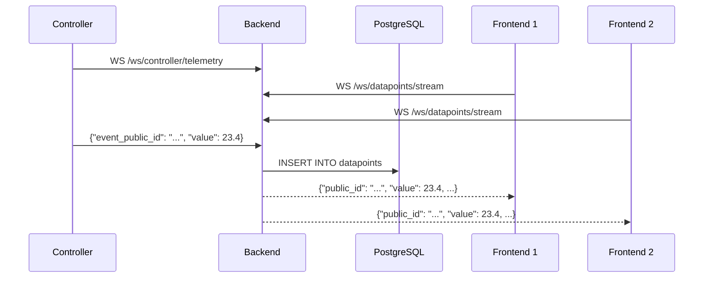

# WebSocket API

WebMACS exposes two WebSocket endpoints for real-time communication.

---

## Endpoints

### `/ws/controller/telemetry`

**Direction:** Controller → Backend

Used by the IoT controller to push sensor readings in real time.

**Connection:**

```
ws://localhost:8000/ws/controller/telemetry?token=<JWT>
```

**Inbound Message (Controller → Backend):**

```json
{
  "event_public_id": "evt_temp01",
  "value": 23.45,
  "timestamp": "2025-01-15T14:32:10.000Z"
}
```

**Behaviour:**

1. Backend validates JWT from query parameter
2. Persists datapoint to database
3. Broadcasts to all `/ws/datapoints/stream` subscribers
4. Sends periodic heartbeat pings (configurable: `WS_HEARTBEAT_INTERVAL`)

---

### `/ws/datapoints/stream`

**Direction:** Backend → Frontend

Used by the Vue frontend to receive live datapoint updates.

**Connection:**

```
ws://localhost:8000/ws/datapoints/stream
```

**Outbound Message (Backend → Frontend):**

```json
{
  "public_id": "dp_abc123",
  "value": 23.45,
  "timestamp": "2025-01-15T14:32:10.000Z",
  "event_public_id": "evt_temp01",
  "experiment_public_id": "exp_001"
}
```

**Behaviour:**

1. Client connects — added to broadcast group
2. Receives every new datapoint as JSON
3. Connection kept alive via heartbeat pings
4. On disconnect — client removed from broadcast group

---

## Message Flow



---

## Frontend Reconnection Strategy

The `useRealtimeDatapoints` composable handles reconnection:

| Attempt | Action |
|---|---|
| 1–3 | Reconnect WebSocket with exponential backoff |
| &gt; 3 | Switch to HTTP polling (`GET /api/v1/datapoints`) |

---

## Nginx Proxy

For WebSocket support through Nginx, the config must include upgrade headers:

```nginx
location /ws/ {
    proxy_pass http://backend:8000;
    proxy_http_version 1.1;
    proxy_set_header Upgrade $http_upgrade;
    proxy_set_header Connection "upgrade";
    proxy_set_header Host $host;
    proxy_read_timeout 86400;
}
```

---

## Next Steps

- [REST API](rest.md) — HTTP endpoint reference
- [WebSocket Architecture](../architecture/websocket.md) — design deep-dive
