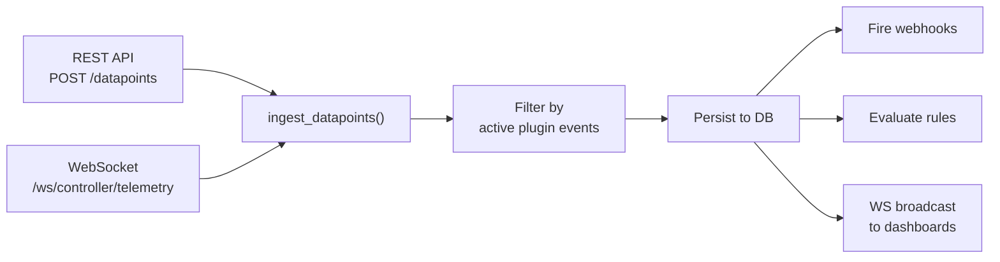

# Backend Architecture

The backend is a **FastAPI** application with async SQLAlchemy, structured as a Python package: `webmacs_backend`.

---

## Package Structure

```
backend/src/webmacs_backend/
├── __init__.py
├── main.py              # Application factory + lifespan
├── config.py            # pydantic-settings Settings
├── database.py          # Engine, session, init_db
├── models.py            # SQLAlchemy ORM models (15 tables)
├── schemas.py           # Pydantic v2 request/response schemas
├── enums.py             # StrEnum definitions (EventType, StatusType, etc.)
├── security.py          # JWT + bcrypt helpers
├── dependencies.py      # FastAPI Depends() factories
├── repository.py        # Generic async CRUD helpers (paginate, get_or_404)
├── api/
│   └── v1/
│       ├── auth.py          # POST /auth/login, /logout, GET /me
│       ├── users.py         # CRUD /users
│       ├── experiments.py   # CRUD /experiments + CSV export
│       ├── events.py        # CRUD /events
│       ├── datapoints.py    # CRUD /datapoints + /series + /latest
│       ├── logging.py       # CRUD /logs
│       ├── rules.py         # CRUD /rules (automation engine)
│       ├── webhooks.py      # CRUD /webhooks + deliveries
│       ├── ota.py           # CRUD /ota + apply/rollback/check/upload
│       ├── dashboards.py    # CRUD /dashboards + widgets
│       ├── plugins.py       # Plugin discovery, instances, channels, packages
│       └── health.py        # GET /health
├── services/
│   ├── ingestion.py           # Shared datapoint ingestion pipeline
│   ├── webhook_dispatcher.py  # HMAC-signed webhook delivery
│   ├── rule_evaluator.py      # Threshold-based rule engine
│   ├── ota_service.py         # Firmware update management
│   ├── updater.py             # System update application
│   ├── log_service.py         # Logging service
│   └── wheel_validator.py     # Plugin wheel upload validation
├── middleware/
│   ├── rate_limit.py          # Request rate limiting
│   └── request_id.py          # X-Request-ID header injection
└── ws/
    ├── connection_manager.py  # Pub/sub hub for WS groups
    └── endpoints.py           # /ws/controller/telemetry, /ws/datapoints/stream
```

---

## Application Lifecycle

```python
@asynccontextmanager
async def lifespan(app: FastAPI) -> AsyncGenerator[None]:
    await init_db()          # Create tables
    await _seed_admin()      # Seed admin if no users exist
    yield
    await engine.dispose()   # Clean shutdown
```

The `lifespan` context manager runs once at startup and shutdown. It replaces the deprecated `on_event` hooks.

---

## Configuration

All settings are loaded from environment variables via **pydantic-settings**:

```python
class Settings(BaseSettings):
    database_url: str
    secret_key: str
    env: str = "development"
    rate_limit_per_minute: int = 300
    ws_heartbeat_interval: int = 30
    github_repo: str = "stefanposs/webmacs"
    # ...
```

See [Environment Variables](../deployment/env-vars.md) for the complete list.

---

## API Routers

All eleven routers are mounted under `/api/v1/`:

| Router | Prefix | Auth | Key Endpoints |
|---|---|---|---|
| `auth` | `/auth` | Public / JWT | `POST /login`, `POST /logout`, `GET /me` |
| `users` | `/users` | Admin | CRUD |
| `experiments` | `/experiments` | JWT | CRUD, `PUT /{id}/stop`, `GET /{id}/export/csv` |
| `events` | `/events` | JWT | CRUD |
| `datapoints` | `/datapoints` | JWT | CRUD, `POST /batch`, `POST /series`, `GET /latest` |
| `logging` | `/logs` | JWT | CRUD, mark read |
| `rules` | `/rules` | Admin | CRUD (threshold-based automation) |
| `webhooks` | `/webhooks` | Admin | CRUD + `GET /{id}/deliveries` |
| `ota` | `/ota` | Admin | CRUD, `POST /{id}/apply`, `POST /{id}/rollback`, `GET /check`, `POST /upload` |
| `dashboards` | `/dashboards` | JWT | CRUD + widget CRUD (nested) |
| `plugins` | `/plugins` | JWT / Admin | Discovery, instance CRUD, channel mappings, package upload |

---

## Generic Repository Layer

The backend uses a **generic repository module** (`repository.py`) to eliminate CRUD boilerplate:

```python
async def paginate[M, S](db, model, schema, page, page_size, base_query=None) -> PaginatedResponse[S]:
    """Generic paginated query with automatic count."""

async def get_or_404(db, model, public_id, entity_name) -> M:
    """Fetch by public_id or raise 404."""

async def delete_by_public_id(db, model, public_id, entity_name) -> StatusResponse:
    """Delete by public_id or raise 404."""
```

All routers share these helpers, keeping endpoint code focused on business logic.

---

## Datapoint Ingestion Pipeline

All incoming datapoints — whether via REST (`POST /datapoints`) or WebSocket (`/ws/controller/telemetry`) — pass through a **single shared pipeline** in `services/ingestion.py`:



This eliminates code duplication and guarantees consistent behaviour across both ingestion paths. Key components:

| Function | Purpose |
|---|---|
| `active_plugin_event_ids(db)` | Returns event IDs that belong to an enabled, connected plugin |
| `active_experiment_id(db)` | Returns the currently running experiment ID (if any) |
| `ingest_datapoints(db, items)` | Validates, persists, and triggers side-effects for a batch of datapoints |

The pipeline also guards against **phantom data** — datapoints submitted for events whose plugin is disabled or disconnected are silently filtered out.

---

## Security

- **bcrypt** for password hashing (via `bcrypt` package directly)
- **JWT** tokens with `python-jose` (HS256, 24h expiry)
- `get_current_user` dependency validates token on every protected route
- Admin-only routes check `user.admin == True`
- Token blacklisting on logout via `blacklist_tokens` table
- Rate limiting middleware (configurable per-minute limit)

---

## Next Steps

- [WebSocket Design](websocket.md) — real-time data streaming
- [Database Layer](database.md) — ORM models and repository helpers
- [REST API Reference](../api/rest.md) — endpoint documentation
- [User Guide: Rules](../guide/rules.md) — automation engine for engineers