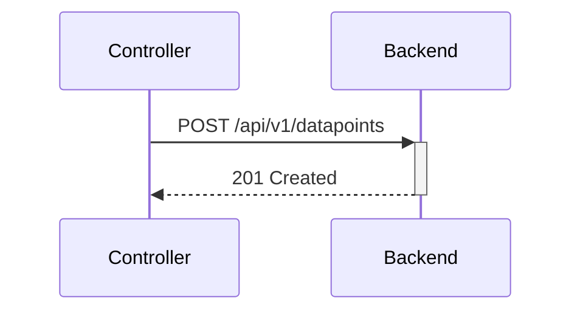
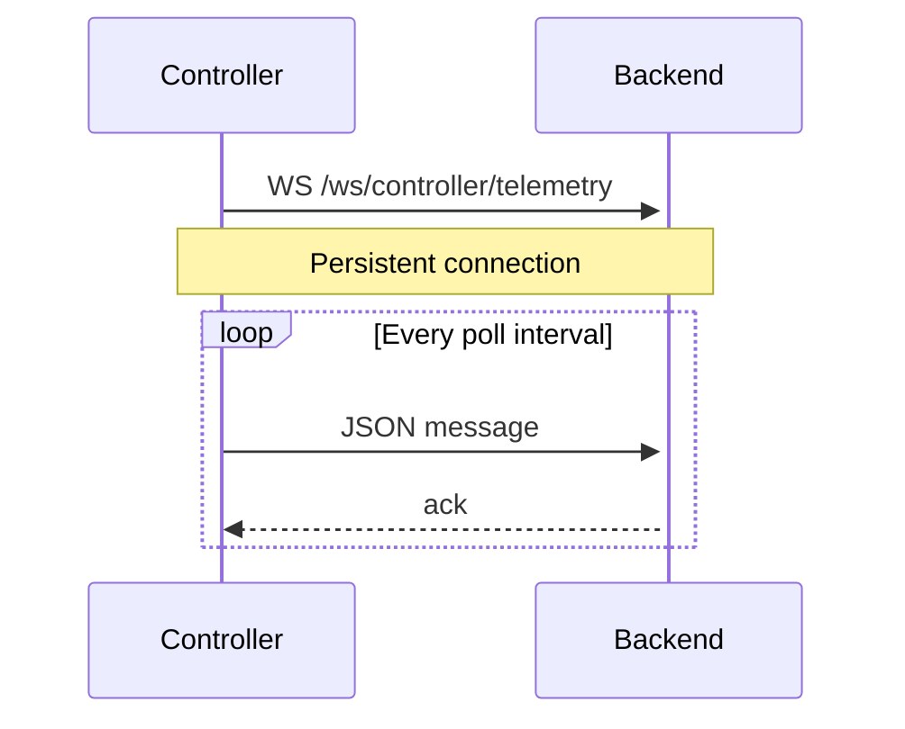
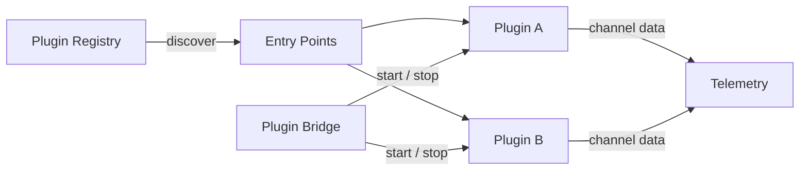

# Controller Architecture

The IoT Controller is a headless Python agent that reads sensor data and pushes it to the backend.

---

## Package Structure

```
controller/src/webmacs_controller/
├── __init__.py
├── __main__.py          # Entry point (python -m webmacs_controller)
├── app.py               # Main application loop
├── config.py            # pydantic-settings configuration
├── schemas.py           # Pydantic models for API payloads
└── services/
    ├── api_client.py      # HTTPX client with retry + auto-reauth
    ├── actuator_manager.py  # Actuator command handling
    ├── demo_seeder.py     # Demo event seeding (dev mode)
    ├── hardware.py        # HardwareInterface ABC + RevPi/Simulated impls    ├── plugin_bridge.py   # Load, start, and manage plugin instances    ├── rule_engine.py     # Valve cycling rule logic
    ├── sensor_manager.py  # Sensor reading abstraction
    └── telemetry.py       # TelemetryTransport Protocol (HTTP / WebSocket)
```

---

## Telemetry Modes

The controller supports two transport modes, selected via `WEBMACS_TELEMETRY_MODE`:

### HTTP Mode (default)



Each sensor reading → one HTTP POST request.

### WebSocket Mode



A single persistent WebSocket connection carries all telemetry.

---

## Transport Protocol

The telemetry layer uses a **Protocol** for pluggability:

```python
class TelemetryTransport(Protocol):
    async def connect(self) -> None: ...
    async def send(self, payload: dict) -> None: ...
    async def disconnect(self) -> None: ...
```

Implementations:

- `HttpTelemetry` — wraps `APIClient.post()`
- `WebSocketTelemetry` — async context manager over `websockets` library

---

## Auto-Reauthentication

The `APIClient` handles JWT lifecycle automatically:

1. Login with configured credentials on startup
2. Store JWT token
3. On any **401 Unauthorized** response → re-login and retry
4. Exponential backoff on repeated failures

---

## Sensor Manager

In **development** mode (`WEBMACS_ENV=development`), the `SensorManager` generates dummy data — sinusoidal waves, random noise, etc. In **production** mode, it reads from the RevPi via `revpimodio2`.

---

## Configuration

```python
class ControllerSettings(BaseSettings):
    webmacs_env: str = "development"
    webmacs_server_url: str = "http://localhost"
    webmacs_server_port: int = 8000
    webmacs_poll_interval: float = 1.0      # min 0.2 s
    webmacs_max_batch_size: int = 100       # 1–500
    webmacs_dedup_enabled: bool = False
    webmacs_telemetry_mode: str = "http"    # "http" | "websocket"
    webmacs_admin_email: str
    webmacs_admin_password: str
```

---

## Plugin Bridge

The **PluginBridge** (`plugin_bridge.py`) loads and manages plugin instances on the controller:

1. **Discovery** — scans installed packages for the `webmacs.plugins` entry-point group via `importlib.metadata`
2. **Instantiation** — creates plugin instances from the backend configuration (plugin ID, config JSON, demo mode)
3. **Lifecycle** — starts, stops, and monitors plugins; reports status back to the backend
4. **Channel I/O** — reads input channels and writes output channels each polling cycle, forwarding values through the telemetry pipeline

Plugins are Python packages that implement the `DevicePlugin` (async) or `SyncDevicePlugin` (blocking) abstract base class from the `webmacs-plugins-core` SDK.



See the [Plugin Development Guide](../development/plugin-development.md) for writing custom plugins.

---

## Next Steps

- [WebSocket Design](websocket.md) — full protocol specification
- [Backend Architecture](backend.md) — how the backend processes data
