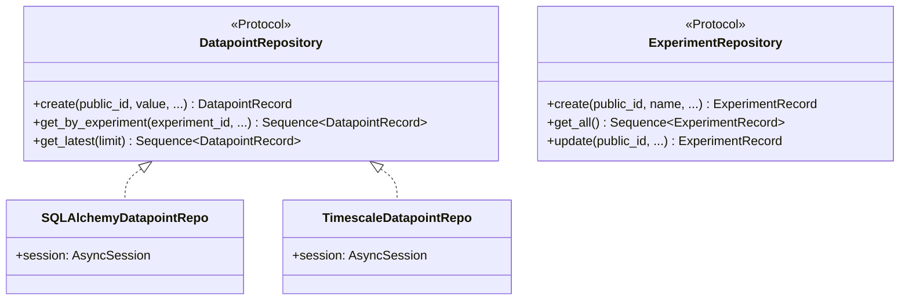

# Database Abstraction

WebMACS uses **PEP 544 Protocols** to abstract the persistence layer. This allows swapping database backends without changing application code.

---

## Design



---

## Protocols

Two Protocols define the storage contracts:

### DatapointRepository

```python
class DatapointRepository(Protocol):
    async def create(self, public_id: str, value: float, timestamp: datetime,
                     event_public_id: str, experiment_public_id: str | None) -> DatapointRecord: ...
    async def get_by_experiment(self, experiment_public_id: str,
                                limit: int, offset: int) -> Sequence[DatapointRecord]: ...
    async def get_latest(self, limit: int) -> Sequence[DatapointRecord]: ...
```

### ExperimentRepository

```python
class ExperimentRepository(Protocol):
    async def create(self, public_id: str, name: str,
                     started_on: datetime, user_public_id: str) -> ExperimentRecord: ...
    async def get_all(self) -> Sequence[ExperimentRecord]: ...
    async def update(self, public_id: str, **kwargs) -> ExperimentRecord: ...
```

---

## Data Transfer Objects

Instead of returning raw ORM models, repositories use lightweight DTOs:

```python
class DatapointRecord:
    __slots__ = ("public_id", "value", "timestamp", "event_public_id", "experiment_public_id")
```

This decouples the API layer from the ORM and keeps the Protocol implementations substitutable.

---

## Dependency Injection

The `STORAGE_BACKEND` environment variable selects the implementation:

```python
# repositories/dependencies.py
def get_datapoint_repo(session: AsyncSession = Depends(get_session)) -> DatapointRepository:
    match settings.storage_backend:
        case "postgresql":
            return SQLAlchemyDatapointRepo(session)
        case "timescale":
            return TimescaleDatapointRepo(session)
        case _:
            raise ValueError(f"Unknown storage backend: {settings.storage_backend}")
```

Routers declare the dependency via FastAPI's `Depends()`:

```python
@router.get("/datapoints")
async def list_datapoints(repo: DatapointRepository = Depends(get_datapoint_repo)):
    return await repo.get_latest(limit=50)
```

---

## Adding a New Backend

1. Create `repositories/my_backend_repo.py`
2. Implement `DatapointRepository` and `ExperimentRepository`
3. Add a case in `dependencies.py`
4. Set `STORAGE_BACKEND=my_backend`

No changes to routers, schemas, or tests needed.

---

## TimescaleDB Support

The `timescale_repo.py` is currently a **stub** — it inherits from the SQLAlchemy implementation. When TimescaleDB-specific features are needed (hypertables, continuous aggregates, compression), this module will diverge.

---

## Next Steps

- [Backend Architecture](backend.md) — full backend structure
- [Deployment: Environment Variables](../deployment/env-vars.md) — configuring `STORAGE_BACKEND`
