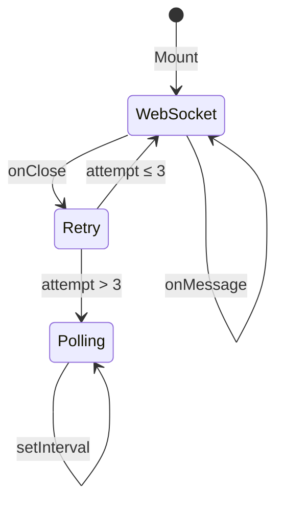

# Frontend Architecture

The frontend is a **Vue 3** single-page application built with **Vite**, **TypeScript**, and **PrimeVue**.

---

## Project Structure

```
frontend/src/
├── main.ts                  # App entry point (createApp, plugins)
├── App.vue                  # Root component (router-view, AppToast)
├── router/                  # Vue Router (7 views + 404)
├── stores/                  # Pinia stores
│   ├── auth.ts              # JWT auth, login/logout
│   ├── experiments.ts       # Experiment CRUD
│   ├── events.ts            # Events CRUD
│   ├── datapoints.ts        # Datapoints fetch
│   └── logs.ts              # Log management
├── views/
│   ├── DashboardView.vue    # Real-time sensor data
│   ├── ExperimentsView.vue  # Experiment management + CSV export
│   ├── EventsView.vue       # Events listing
│   ├── DatapointsView.vue   # Raw datapoints table
│   ├── LogsView.vue         # System logs
│   ├── UsersView.vue        # User management (admin)
│   ├── LoginView.vue        # Authentication
│   └── NotFoundView.vue     # 404 page
├── composables/
│   ├── useRealtimeDatapoints.ts   # WS-first + polling fallback
│   ├── useNotification.ts         # Toast notification system
│   └── useApi.ts                  # Axios wrapper with auth headers
├── services/
│   └── websocket.ts         # Generic reconnecting WebSocket client
├── components/
│   └── AppToast.vue          # Custom toast notifications
├── types/                    # TypeScript interfaces
└── assets/                   # Styles, images
```

---

## State Management (Pinia)

Each store encapsulates a domain:

```typescript
// stores/experiments.ts
export const useExperimentsStore = defineStore('experiments', () => {
  const experiments = ref<Experiment[]>([])
  const loading = ref(false)

  async function fetchAll() { /* ... */ }
  async function create(name: string) { /* ... */ }
  async function stop(id: string) { /* ... */ }

  return { experiments, loading, fetchAll, create, stop }
})
```

---

## Real-Time Data Composable

The `useRealtimeDatapoints` composable implements the **WS-first, polling-fallback** strategy:



```typescript
const { datapoints, connectionMode } = useRealtimeDatapoints({
  wsUrl: '/ws/datapoints/stream',
  pollUrl: '/api/v1/datapoints',
  pollInterval: 2000,
  maxWsRetries: 3,
})
```

Returns:

| Property | Type | Description |
|---|---|---|
| `datapoints` | `Ref<Datapoint[]>` | Latest datapoints |
| `connectionMode` | `Ref<'ws' \| 'polling' \| 'disconnected'>` | Current transport |

---

## Custom Toast Notifications

`AppToast.vue` replaces PrimeVue's toast with a custom system:

- Gradient variants: `success`, `error`, `warning`, `info`
- Slide-in/out animations via `<TransitionGroup>`
- Rendered via `<Teleport to="body">`
- Uses design tokens for consistent theming

---

## Build & Dev

```bash
npm run dev          # Vite dev server → http://localhost:5173
npm run build        # Production build → dist/
npm run lint         # ESLint
npm run type-check   # vue-tsc
```

In production, **Nginx** serves the built SPA and proxies `/api/` and `/ws/` to the backend.

---

## Next Steps

- [Controller Architecture](controller.md) — the IoT agent
- [WebSocket Design](../architecture/websocket.md) — protocol details
