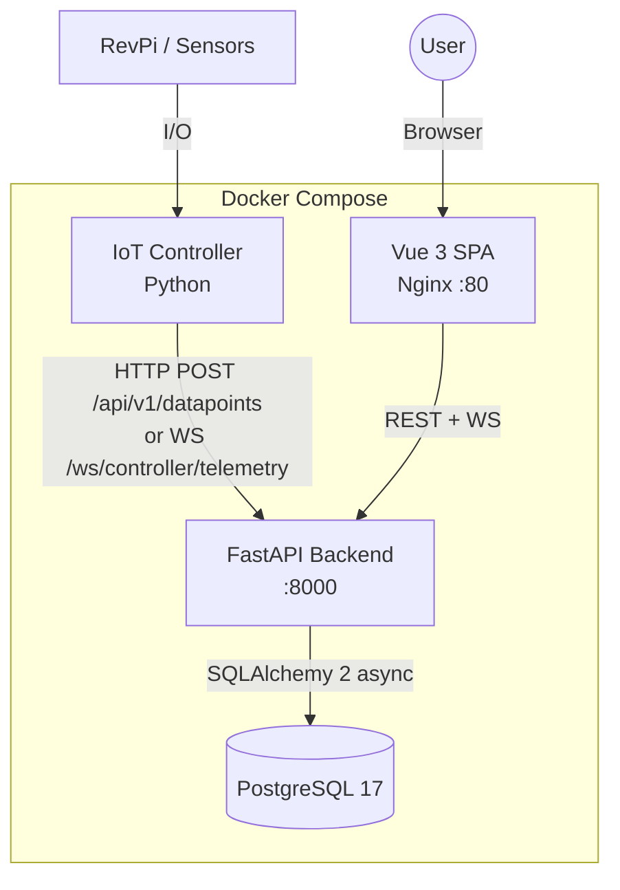
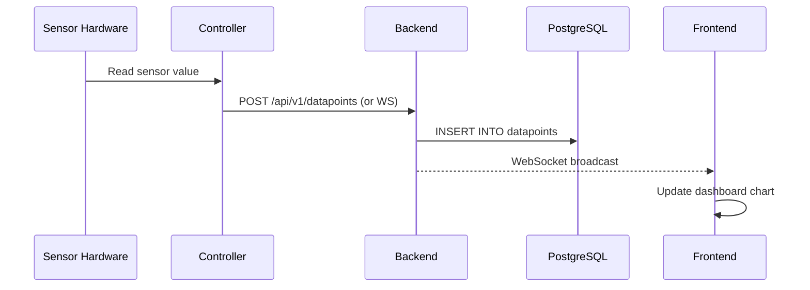

# System Overview

WebMACS is a four-component system connected via REST, WebSocket, and a shared PostgreSQL database.

---

## High-Level Architecture

---

## Components

### Backend (FastAPI)

The backend is the central hub. It:

- Exposes a versioned REST API (`/api/v1/`) with 6 routers
- Serves two WebSocket endpoints for real-time data
- Uses SQLAlchemy 2 async ORM with a repository protocol layer
- Handles JWT authentication with bcrypt password hashing
- Seeds an initial admin user on first boot

**Key files:** `main.py`, `config.py`, `models.py`, `schemas.py`, `security.py`

[**Details → Backend Architecture**](backend.md)

---

### Frontend (Vue 3)

A single-page application served by Nginx:

- **Vue 3** with Composition API and `<script setup>`
- **TypeScript** throughout
- **Pinia** for state management (auth, experiments, events, datapoints, logs)
- **PrimeVue** component library
- Custom `useRealtimeDatapoints` composable (WS + HTTP fallback)
- Custom `AppToast` notification system

**Key views:** Dashboard, Experiments, Events, Datapoints, Logs, Users, Login

[**Details → Frontend Architecture**](frontend.md)

---

### Controller (IoT Agent)

A headless Python process that:

- Reads sensor values from hardware (or generates dummy data in dev mode)
- Authenticates with the backend via JWT
- Pushes datapoints via HTTP or WebSocket (configurable)
- Implements auto-reauthentication on 401 responses
- Has retry logic with exponential backoff

**Telemetry modes:** `http` (default) or `websocket`

[**Details → Controller Architecture**](controller.md)

---

### Database (PostgreSQL)

- **PostgreSQL 17-alpine** in Docker
- Async driver: `asyncpg`
- Tables: `users`, `experiments`, `events`, `datapoints`, `logs`
- Protocol-based repository abstraction for swapping backends

[**Details → Database Abstraction**](database.md)

---

## Data Flow

---

## Technology Decisions

| Decision | Choice | Rationale |
|---|---|---|
| Python 3.14 | Latest RC | StrEnum, PEP 695 generics, performance |
| FastAPI | Async framework | Native async, Pydantic v2, OpenAPI docs |
| SQLAlchemy 2 | Async ORM | Mature, type-safe, async session support |
| Vue 3 | Frontend framework | Composition API, TypeScript, reactive |
| Pinia | State management | Official Vue store, devtools support |
| Docker Compose | Orchestration | Simple, reproducible, single-command |
| Protocol pattern | DB abstraction | PEP 544 structural subtyping, plug-and-play |

---

## Next Steps

- [Backend](backend.md) — FastAPI internals
- [WebSocket Design](websocket.md) — real-time protocol details
- [Database Abstraction](database.md) — Protocol-based storage layer
