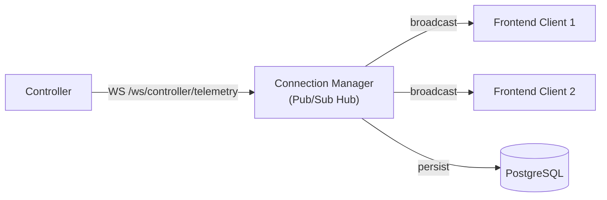
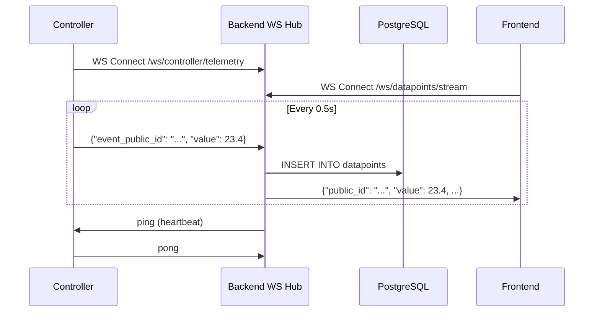

# WebSocket Design

WebMACS uses WebSockets for two real-time channels: controller telemetry and frontend data streaming.

---

## Endpoints

| Endpoint | Direction | Purpose |
|---|---|---|
| `/ws/controller/telemetry` | Controller → Backend | Push sensor readings |
| `/ws/datapoints/stream` | Backend → Frontend | Broadcast new datapoints |

---

## Architecture



---

## Connection Manager

The `ConnectionManager` is a pub/sub hub that:

1. Accepts incoming WebSocket connections
2. Maintains a set of active connections per topic
3. Broadcasts messages to all subscribers
4. Handles disconnection cleanup

```python
class ConnectionManager:
    def __init__(self):
        self._connections: dict[str, set[WebSocket]] = {}

    async def connect(self, topic: str, ws: WebSocket): ...
    async def disconnect(self, topic: str, ws: WebSocket): ...
    async def broadcast(self, topic: str, data: dict): ...
```

---

## Controller → Backend Protocol

### Message Format

```json
{
  "event_public_id": "evt_temp01",
  "value": 23.45,
  "timestamp": "2025-01-15T14:32:10.000Z"
}
```

### Flow

1. Controller opens WS to `/ws/controller/telemetry`
2. Backend authenticates via token query parameter
3. Controller sends JSON messages at `poll_interval`
4. Backend persists to DB and broadcasts to `/ws/datapoints/stream` subscribers
5. Backend sends heartbeat pings every `ws_heartbeat_interval` seconds

---

## Backend → Frontend Protocol

### Message Format

```json
{
  "public_id": "dp_abc123",
  "value": 23.45,
  "timestamp": "2025-01-15T14:32:10.000Z",
  "event_public_id": "evt_temp01",
  "experiment_public_id": "exp_001"
}
```

### Client Reconnection

The frontend `websocket.ts` service implements:

- Automatic reconnection with exponential backoff
- Maximum 3 retry attempts
- Fallback to HTTP polling after exhausting retries
- Clean disconnect on component unmount

---

## Nginx Proxy Configuration

For WebSocket passthrough, the Nginx config includes:

```nginx
location /ws/ {
    proxy_pass http://backend:8000;
    proxy_http_version 1.1;
    proxy_set_header Upgrade $http_upgrade;
    proxy_set_header Connection "upgrade";
    proxy_set_header Host $host;
    proxy_read_timeout 86400;
}
```

The `proxy_read_timeout` is set to 24 hours to prevent premature disconnection of long-lived WebSocket connections.

---

## Sequence Diagram



---

## Next Steps

- [Database Abstraction](database.md) — how data is persisted
- [API Reference: WebSocket](../api/websocket.md) — endpoint documentation
