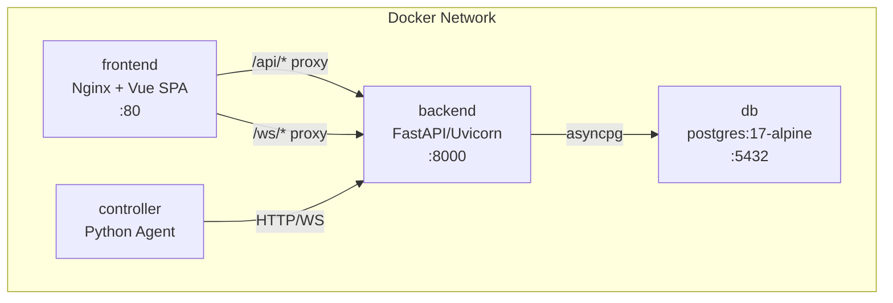

# Docker Deployment

!!! note "Development vs. Production"
    The `docker-compose.yml` in the project root is designed for **local development**.
    For production deployment on a RevPi or server, use `scripts/install.sh` which sets up
    `docker-compose.prod.yml` with proper credentials, systemd auto-start, and the OTA updater.
    See the [Installation Guide](installation-guide.md) for details.

WebMACS runs as a four-container Docker Compose stack.

---

## Architecture



---

## Quick Start

```bash
cp .env.example .env
docker compose up --build -d
```

### Verify

```bash
docker compose ps
# All 4 services should show "healthy" or "running"

curl http://localhost/health
# {"status":"ok","version":"0.1.0","database":"ok",...}
```

---

## Services

### `db` — PostgreSQL

```yaml
image: postgres:17-alpine
ports: ["5432:5432"]
volumes: [pgdata:/var/lib/postgresql/data]
healthcheck: pg_isready -U webmacs
```

### `backend` — FastAPI

```yaml
build: docker/backend.Dockerfile
ports: ["8000:8000"]
depends_on: db (healthy)
healthcheck: urllib.request.urlopen('http://localhost:8000/health')
```

### `frontend` — Nginx + Vue

```yaml
build: docker/frontend.Dockerfile
ports: ["80:80"]
depends_on: [backend]
```

Nginx serves the built Vue SPA and proxies `/api/` and `/ws/` to the backend.

### `controller` — IoT Agent

```yaml
build: docker/controller.Dockerfile
depends_on: backend (healthy)
```

---

## Docker Files

| File | Description |
|---|---|
| `docker/backend.Dockerfile` | Python 3.13-slim + UV + FastAPI |
| `docker/frontend.Dockerfile` | Node 22 build stage → Nginx serve stage |
| `docker/controller.Dockerfile` | Python 3.13-slim + UV + controller |
| `docker/nginx.conf` | Nginx config with API + WebSocket proxy |

---

## Common Commands

```bash
# Start all services
docker compose up -d

# Rebuild after code changes
docker compose up --build -d

# View logs
docker compose logs -f backend
docker compose logs -f controller

# Stop everything
docker compose down

# Stop and remove data
docker compose down -v   # ⚠️ deletes database

# Restart single service
docker compose restart backend
```

---

## Volumes

| Volume | Mounted At | Purpose |
|---|---|---|
| `pgdata` | `/var/lib/postgresql/data` | Persistent database storage |

---

## OTA Updates

WebMACS includes a built-in Over-The-Air update system. Updates are distributed as `.tar.gz` bundles containing Docker images and metadata.

```bash
# Build a bundle on your dev machine
just bundle
```

Apply via the **OTA Updates** page in the web UI, or by copying to `/opt/webmacs/updates/` on the device.

!!! tip "Full OTA documentation"
    See the [OTA Updates Guide](../guide/ota.md) for build steps, upload, USB/SCP delivery, rollback, and Balena comparison.

---

## Webhooks

WebMACS notifies external systems (Slack, Node-RED, Home Assistant, custom endpoints) via HMAC-signed HTTP webhooks.

Configure via **Settings → Webhooks** in the web UI or the [REST API](../api/rest.md#webhooks).

!!! tip "Full webhook documentation"
    See the [Webhooks Guide](../guide/webhooks.md) for event types, payload format, HMAC verification, and integration examples.

---

## Simple Installation for Customers

For end-user installations on Revolution Pi or similar devices, use the automated installer:

```bash
# 1. Transfer the update bundle to the device
scp webmacs-update-2.0.0.tar.gz pi@<device-ip>:/tmp/

# 2. SSH into the device
ssh pi@<device-ip>

# 3. Run the one-line installer
sudo bash /tmp/install.sh /tmp/webmacs-update-2.0.0.tar.gz
```

The installer handles everything automatically:

| Step | What it does |
|---|---|
| Docker | Installs Docker + Compose if not present |
| Directory | Creates `/opt/webmacs` with update folders |
| Credentials | Generates random `SECRET_KEY`, `DB_PASSWORD`, and admin password |
| Images | Loads Docker images from the bundle |
| Services | Starts all 4 containers |
| Boot | Creates systemd service for auto-start |

After installation, open `http://<device-ip>` in a browser and log in with the credentials shown during install.

!!! info "No Internet Required"
    The installer works completely offline. All Docker images are pre-built
    and included in the update bundle.

For detailed step-by-step instructions, see the [Installation Guide](installation-guide.md).

---

## Balena — When Does It Make Sense?

WebMACS includes its own OTA update system (see [OTA Updates](../guide/ota.md)) which is ideal for **single devices or small fleets**.

[Balena](https://www.balena.io/) can be interesting if you:

- Manage **50+ devices** across multiple locations
- Need fleet-wide rollouts with staged canary deployments
- Want delta updates (only changed layers) to save bandwidth
- Need a cloud dashboard for remote device management

| | WebMACS OTA | Balena |
|---|---|---|
| **Cost** | Free (GitHub Actions) | Paid (after 10 devices) |
| **Offline** | ✅ Full offline support | ❌ Requires cloud connection |
| **Dependencies** | Docker only | Balena OS + account |
| **Control** | Full — your code, your infra | Vendor lock-in |
| **Ideal for** | 1–50 devices | 50+ device fleets |

Since WebMACS runs in Docker containers, migrating to Balena later requires **no code changes** — only the deployment layer changes.

---

## Next Steps

- [Installation Guide](installation-guide.md) — detailed customer installation
- [Production Deployment](production.md) — hardening for production
- [Environment Variables](env-vars.md) — full configuration reference
