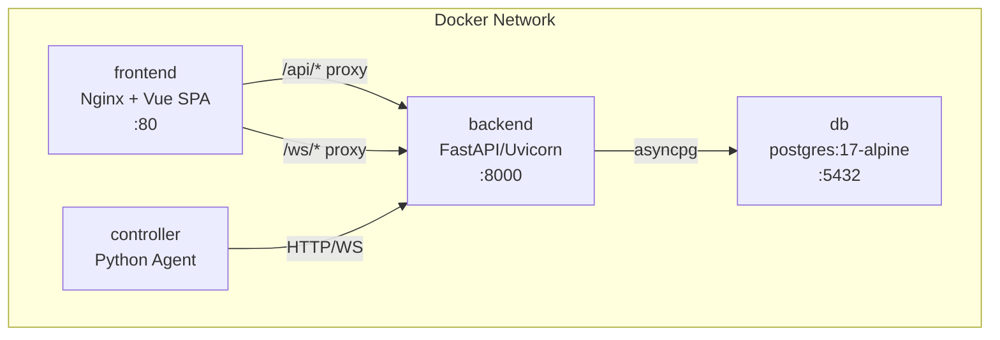
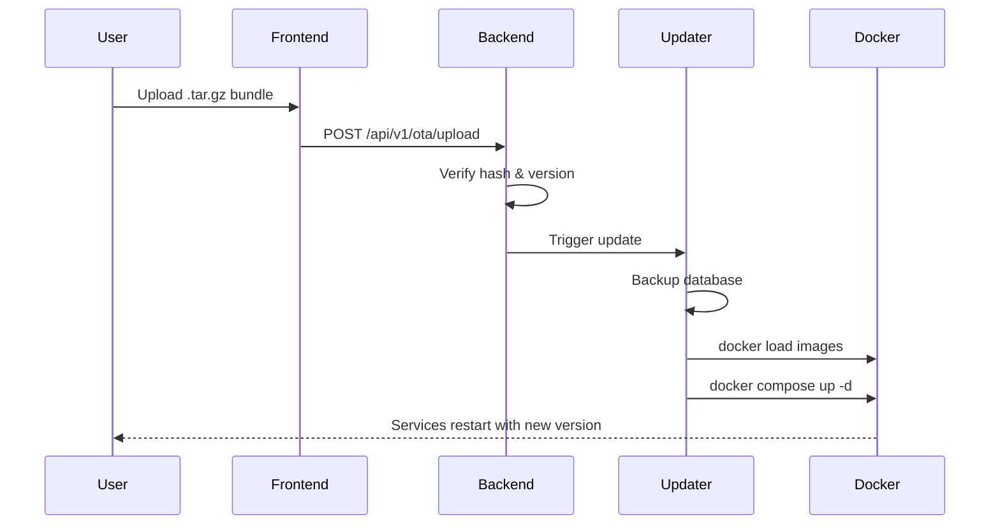

# Docker Deployment

!!! note "Development vs. Production"
    The `docker-compose.yml` in the project root is designed for **local development**.
    For production deployment on a RevPi or server, use `scripts/install.sh` which sets up
    `docker-compose.prod.yml` with proper credentials, systemd auto-start, and the OTA updater.
    See the [Installation Guide](installation-guide.md) for details.

WebMACS runs as a four-container Docker Compose stack.

---

## Architecture



---

## Quick Start

```bash
cp .env.example .env
docker compose up --build -d
```

### Verify

```bash
docker compose ps
# All 4 services should show "healthy" or "running"

curl http://localhost/health
# {"status":"healthy"}
```

---

## Services

### `db` — PostgreSQL

```yaml
image: postgres:17-alpine
ports: ["5432:5432"]
volumes: [pgdata:/var/lib/postgresql/data]
healthcheck: pg_isready -U webmacs
```

### `backend` — FastAPI

```yaml
build: docker/backend.Dockerfile
ports: ["8000:8000"]
depends_on: db (healthy)
healthcheck: urllib.request.urlopen('http://localhost:8000/health')
```

### `frontend` — Nginx + Vue

```yaml
build: docker/frontend.Dockerfile
ports: ["80:80"]
depends_on: [backend]
```

Nginx serves the built Vue SPA and proxies `/api/` and `/ws/` to the backend.

### `controller` — IoT Agent

```yaml
build: docker/controller.Dockerfile
depends_on: backend (healthy)
```

---

## Docker Files

| File | Description |
|---|---|
| `docker/backend.Dockerfile` | Python 3.13-slim + UV + FastAPI |
| `docker/frontend.Dockerfile` | Node 22 build stage → Nginx serve stage |
| `docker/controller.Dockerfile` | Python 3.13-slim + UV + controller |
| `docker/nginx.conf` | Nginx config with API + WebSocket proxy |

---

## Common Commands

```bash
# Start all services
docker compose up -d

# Rebuild after code changes
docker compose up --build -d

# View logs
docker compose logs -f backend
docker compose logs -f controller

# Stop everything
docker compose down

# Stop and remove data
docker compose down -v   # ⚠️ deletes database

# Restart single service
docker compose restart backend
```

---

## Volumes

| Volume | Mounted At | Purpose |
|---|---|---|
| `pgdata` | `/var/lib/postgresql/data` | Persistent database storage |

---

## OTA Updates

WebMACS includes a built-in Over-The-Air (OTA) update system. Updates are distributed as `.tar.gz` bundles containing Docker images and metadata.

### How OTA Works



### Building an Update Bundle

Use the `just bundle` command on your development machine:

```bash
just bundle
```

This creates `webmacs-update-<version>.tar.gz` containing:

- `images.tar` — all Docker images
- `docker-compose.prod.yml` — production compose file
- `metadata.json` — version, build timestamp, SHA-256 hash

### Applying Updates

There are three ways to apply an update:

=== "Web UI (Recommended)"

    1. Navigate to **OTA Updates** in the sidebar
    2. Click **Upload Bundle**
    3. Select the `.tar.gz` bundle file
    4. The system verifies integrity, backs up the database, loads new images, and restarts
    5. The page reloads when the update is complete

=== "USB / SCP"

    Copy the bundle to the device's update directory:

    ```bash
    scp webmacs-update-2.1.0.tar.gz pi@<device-ip>:/opt/webmacs/updates/
    ```

    The built-in updater watches `/opt/webmacs/updates/` and automatically applies new bundles within 60 seconds.

=== "Command Line"

    ```bash
    cd /opt/webmacs
    sudo tar -xzf updates/webmacs-update-2.1.0.tar.gz -C /tmp/webmacs-update
    sudo docker load -i /tmp/webmacs-update/images.tar
    sudo sed -i "s/^WEBMACS_VERSION=.*/WEBMACS_VERSION=2.1.0/" .env
    sudo docker compose -f docker-compose.prod.yml --env-file .env up -d
    ```

### Rollback

If an update fails, the system automatically rolls back. Manual rollback:

```bash
cd /opt/webmacs
# Restore database backup
cat updates/backups/pre-update-*.sql | docker compose exec -T db psql -U webmacs webmacs

# Load previous images
docker load -i updates/backups/images-prev.tar
docker compose -f docker-compose.prod.yml up -d
```

---

## Webhooks

WebMACS can notify external systems when events occur via HTTP webhooks.

### Supported Events

| Event | Trigger |
|---|---|
| `sensor_reading` | New datapoint is recorded |
| `experiment_started` | Experiment starts |
| `experiment_stopped` | Experiment stops |
| `rule_triggered` | An automation rule fires |
| `system_alert` | Health or threshold alert |

### Configuring Webhooks

=== "Web UI"

    1. Navigate to **Settings → Webhooks**
    2. Click **Add Webhook**
    3. Enter the target URL (e.g., `https://hooks.example.com/services/...`)
    4. Select which events should trigger the webhook
    5. Optionally add a secret for HMAC signature verification

=== "REST API"

    ```bash
    curl -X POST http://localhost/api/v1/webhooks \
      -H "Authorization: Bearer $TOKEN" \
      -H "Content-Type: application/json" \
      -d '{
        "url": "https://your-server.com/webhook",
        "events": ["sensor_reading", "experiment_started"],
        "secret": "optional-hmac-secret"
      }'
    ```

### Webhook Payload Format

```json
{
  "event": "sensor_reading",
  "timestamp": "2025-01-15T14:30:00Z",
  "data": {
    "sensor": "evt_abc123",
    "value": 23.5
  }
}
```

### Integration Examples

=== "Slack"

    Use a Slack Incoming Webhook URL:

    ```
    https://hooks.example.com/services/T00000000/B00000000/XXXXXXXX
    ```

    Slack will display the JSON payload as a message in your channel.

=== "Node-RED"

    Create an HTTP In node listening on `/webmacs-hook` and point the webhook URL to your Node-RED instance:

    ```
    http://<nodered-ip>:1880/webmacs-hook
    ```

=== "Home Assistant"

    Use a Home Assistant webhook automation:

    ```
    http://<ha-ip>:8123/api/webhook/<webhook-id>
    ```

=== "Custom Script"

    Receive webhooks with a simple Python server:

    ```python
    from flask import Flask, request

    app = Flask(__name__)

    @app.post("/webhook")
    def handle():
        data = request.json
        print(f"Event: {data['event']}, Value: {data['data']}")
        return "OK", 200
    ```

### Security

Webhooks support HMAC-SHA256 signature verification. When a `secret` is configured,
every request includes an `X-WebMACS-Signature` header:

```
X-WebMACS-Signature: sha256=<hex-digest>
```

Verify the signature in your receiving endpoint to ensure authenticity.

---

## Simple Installation for Customers

For end-user installations on Revolution Pi or similar devices, use the automated installer:

```bash
# 1. Transfer the update bundle to the device
scp webmacs-update-2.0.0.tar.gz pi@<device-ip>:/tmp/

# 2. SSH into the device
ssh pi@<device-ip>

# 3. Run the one-line installer
sudo bash /tmp/install.sh /tmp/webmacs-update-2.0.0.tar.gz
```

The installer handles everything automatically:

| Step | What it does |
|---|---|
| Docker | Installs Docker + Compose if not present |
| Directory | Creates `/opt/webmacs` with update folders |
| Credentials | Generates random `SECRET_KEY`, `DB_PASSWORD`, and admin password |
| Images | Loads Docker images from the bundle |
| Services | Starts all 4 containers |
| Boot | Creates systemd service for auto-start |

After installation, open `http://<device-ip>` in a browser and log in with the credentials shown during install.

!!! info "No Internet Required"
    The installer works completely offline. All Docker images are pre-built
    and included in the update bundle.

For detailed step-by-step instructions, see the [Installation Guide](installation-guide.md).

---

## Balena — When Does It Make Sense?

WebMACS includes its own OTA update system (see [OTA Updates](../guide/ota.md)) which is ideal for **single devices or small fleets**.

[Balena](https://www.balena.io/) can be interesting if you:

- Manage **50+ devices** across multiple locations
- Need fleet-wide rollouts with staged canary deployments
- Want delta updates (only changed layers) to save bandwidth
- Need a cloud dashboard for remote device management

| | WebMACS OTA | Balena |
|---|---|---|
| **Cost** | Free (GitHub Actions) | Paid (after 10 devices) |
| **Offline** | ✅ Full offline support | ❌ Requires cloud connection |
| **Dependencies** | Docker only | Balena OS + account |
| **Control** | Full — your code, your infra | Vendor lock-in |
| **Ideal for** | 1–50 devices | 50+ device fleets |

Since WebMACS runs in Docker containers, migrating to Balena later requires **no code changes** — only the deployment layer changes.

---

## Next Steps

- [Installation Guide](installation-guide.md) — detailed customer installation
- [Production Deployment](production.md) — hardening for production
- [Environment Variables](env-vars.md) — full configuration reference
