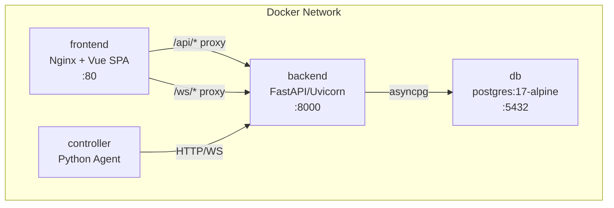

# Docker Deployment

WebMACS runs as a four-container Docker Compose stack.

---

## Architecture



---

## Quick Start

```bash
cp .env.example .env
docker compose up --build -d
```

### Verify

```bash
docker compose ps
# All 4 services should show "healthy" or "running"

curl http://localhost/health
# {"status":"healthy"}
```

---

## Services

### `db` — PostgreSQL

```yaml
image: postgres:17-alpine
ports: ["5432:5432"]
volumes: [pgdata:/var/lib/postgresql/data]
healthcheck: pg_isready -U webmacs
```

### `backend` — FastAPI

```yaml
build: docker/backend.Dockerfile
ports: ["8000:8000"]
depends_on: db (healthy)
healthcheck: urllib.request.urlopen('http://localhost:8000/health')
```

### `frontend` — Nginx + Vue

```yaml
build: docker/frontend.Dockerfile
ports: ["80:80"]
depends_on: [backend]
```

Nginx serves the built Vue SPA and proxies `/api/` and `/ws/` to the backend.

### `controller` — IoT Agent

```yaml
build: docker/controller.Dockerfile
depends_on: backend (healthy)
```

---

## Docker Files

| File | Description |
|---|---|
| `docker/backend.Dockerfile` | Python 3.14-rc-slim + UV + FastAPI |
| `docker/frontend.Dockerfile` | Node 22 build stage → Nginx serve stage |
| `docker/controller.Dockerfile` | Python 3.14-rc-slim + UV + controller |
| `docker/nginx.conf` | Nginx config with API + WebSocket proxy |

---

## Common Commands

```bash
# Start all services
docker compose up -d

# Rebuild after code changes
docker compose up --build -d

# View logs
docker compose logs -f backend
docker compose logs -f controller

# Stop everything
docker compose down

# Stop and remove data
docker compose down -v   # ⚠️ deletes database

# Restart single service
docker compose restart backend
```

---

## Volumes

| Volume | Mounted At | Purpose |
|---|---|---|
| `pgdata` | `/var/lib/postgresql/data` | Persistent database storage |

---

## Next Steps

- [Production Deployment](production.md) — hardening for production
- [Environment Variables](env-vars.md) — full configuration reference
