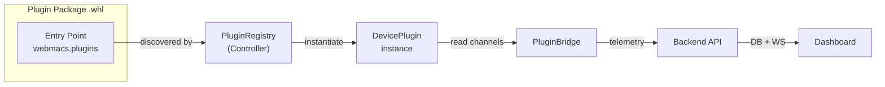
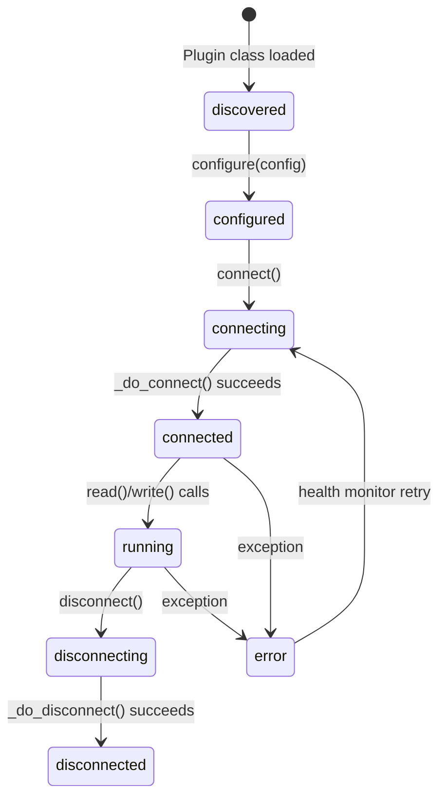

# Plugin Development Guide

Build custom device plugins for WebMACS. This guide walks you through the SDK, the plugin lifecycle, and a complete example — from a blank file to an installable `.whl` package.

---

## Architecture



Plugins are Python packages that register themselves via the `webmacs.plugins` entry point group. The controller discovers them at startup, instantiates the configured plugin classes, and reads their channels in the same polling loop as hardware I/O.

---

## Quick Start

### 1. Create the Package Structure

```
my-plugin/
├── pyproject.toml
├── README.md
└── src/
    └── my_plugin/
        └── __init__.py
```

### 2. Define the Plugin Class

```python title="src/my_plugin/__init__.py"
from webmacs_plugins_core import (
    ChannelDescriptor,
    ChannelDirection,
    ChannelValue,
    DevicePlugin,
    PluginMeta,
    SimulationSpec,
)


class MyPlugin(DevicePlugin):
    """A minimal example plugin."""

    meta = PluginMeta(
        id="my-plugin",
        name="My Custom Plugin",
        version="1.0.0",
        vendor="My Company",
        description="Reads data from my custom sensor.",
        url="https://example.com",
    )

    def get_channels(self) -> list[ChannelDescriptor]:
        return [
            ChannelDescriptor(
                id="temperature",
                name="Temperature",
                direction=ChannelDirection.input,
                unit="°C",
                min_value=-40.0,
                max_value=125.0,
                simulation=SimulationSpec(
                    profile="sine_wave",
                    base_value=22.0,
                    amplitude=5.0,
                    period_seconds=120,
                ),
            ),
            ChannelDescriptor(
                id="heater",
                name="Heater Output",
                direction=ChannelDirection.output,
                unit="%",
                min_value=0.0,
                max_value=100.0,
                safe_value=0.0,  # Turn off on disconnect
            ),
        ]

    async def _do_connect(self) -> None:
        # Initialize your hardware connection here
        pass

    async def _do_disconnect(self) -> None:
        # Clean up hardware resources here
        pass

    async def _do_read(self, channel_id: str) -> ChannelValue | None:
        # Read a value from your hardware
        if channel_id == "temperature":
            return 23.5  # Replace with actual hardware read
        return None

    async def _do_write(self, channel_id: str, value: ChannelValue) -> None:
        # Write a value to your hardware
        if channel_id == "heater":
            pass  # Replace with actual hardware write
```

### 3. Configure the Package

```toml title="pyproject.toml"
[build-system]
requires = ["hatchling"]
build-backend = "hatchling.build"

[project]
name = "webmacs-plugin-my-plugin"
version = "1.0.0"
description = "My custom WebMACS plugin"
requires-python = ">=3.12"
dependencies = ["webmacs-plugins-core>=0.1.0"]

[project.entry-points."webmacs.plugins"]
my-plugin = "my_plugin:MyPlugin"

[tool.hatch.build.targets.wheel]
packages = ["src/my_plugin"]
```

!!! important "Entry Point"
    The `[project.entry-points."webmacs.plugins"]` section is **required**. Without it, the plugin will not be discovered. The key (`my-plugin`) should match `meta.id`.

### 4. Build and Upload

```bash
# Build the wheel
pip install build
python -m build --wheel

# Upload via the WebMACS UI
# Go to Plugins → Packages → Upload
# Select dist/webmacs_plugin_my_plugin-1.0.0-py3-none-any.whl
```

---

## Plugin SDK Reference

### `DevicePlugin` (async)

The primary base class. All methods are async.

#### Class Variables

| Variable | Type | Required | Description |
|---|---|---|---|
| `meta` | `PluginMeta` | **Yes** | Identity, version, vendor info |
| `config_schema` | `type[PluginInstanceConfig]` | No | Custom config model (default: `PluginInstanceConfig`) |

#### Lifecycle



#### Abstract Methods to Implement

| Method | Signature | Description |
|---|---|---|
| `get_channels` | `() → list[ChannelDescriptor]` | Define the channels this plugin exposes |
| `_do_connect` | `() → None` | Connect to hardware (skipped in demo mode) |
| `_do_disconnect` | `() → None` | Disconnect from hardware |
| `_do_read` | `(channel_id: str) → ChannelValue \| None` | Read a single channel value |
| `_do_write` | `(channel_id: str, value: ChannelValue) → None` | Write a value to a channel |

#### Built-in Behaviour

You get these features for free:

- **Demo mode simulation** — each channel's `SimulationSpec` generates realistic sensor data
- **Value conversion** — `read_conversion` / `write_conversion` on channels (linear, divide, clamp)
- **Output clamping** — values are clamped to `[min_value, max_value]` on write
- **Safe state** — on disconnect or error, all outputs with `safe_value` are written automatically
- **Health monitoring** — automatic reconnection with exponential backoff
- **Context manager** — `async with plugin:` handles connect/disconnect

### `SyncDevicePlugin`

For hardware libraries that are **not** async-compatible. Wraps blocking calls in `asyncio.to_thread()` with a per-instance lock.

| Method | Replaces |
|---|---|
| `connect_sync()` | `_do_connect()` |
| `disconnect_sync()` | `_do_disconnect()` |
| `read_sync(channel_id)` | `_do_read(channel_id)` |
| `write_sync(channel_id, value)` | `_do_write(channel_id, value)` |

```python
from webmacs_plugins_core import SyncDevicePlugin

class MyBlockingPlugin(SyncDevicePlugin):
    meta = PluginMeta(id="blocking", name="Blocking Plugin", version="1.0.0")

    def get_channels(self) -> list[ChannelDescriptor]:
        return [...]

    def connect_sync(self) -> None:
        self.device = MyBlockingLibrary.connect("/dev/ttyUSB0")

    def disconnect_sync(self) -> None:
        self.device.close()

    def read_sync(self, channel_id: str) -> ChannelValue | None:
        return self.device.read(channel_id)

    def write_sync(self, channel_id: str, value: ChannelValue) -> None:
        self.device.write(channel_id, value)
```

---

## Channel Configuration

### `ChannelDescriptor`

| Field | Type | Default | Description |
|---|---|---|---|
| `id` | `str` | — | Unique channel identifier |
| `name` | `str` | — | Human-readable display name |
| `direction` | `ChannelDirection` | — | `input`, `output`, or `bidirectional` |
| `data_type` | `str` | `"float"` | Value type hint |
| `unit` | `str` | `""` | Engineering unit (°C, %, bar, …) |
| `min_value` | `float` | `0.0` | Minimum allowed value |
| `max_value` | `float` | `100.0` | Maximum allowed value |
| `read_conversion` | `ConversionSpec` | identity | Raw → engineering value conversion |
| `write_conversion` | `ConversionSpec` | identity | Engineering → raw value conversion |
| `simulation` | `SimulationSpec` | sine wave | Demo mode signal shape |
| `safe_value` | `float \| None` | `None` | Value written on disconnect/error |
| `ui_hints` | `dict[str, str]` | `{}` | Frontend hints: `icon`, `color`, `widget_type` |

### Value Conversions

Built-in converters transform raw hardware values to engineering units:

| Type | Parameters | Formula |
|---|---|---|
| `"none"` | — | `y = x` (identity) |
| `"linear"` | `scale`, `offset` | `y = x * scale + offset` |
| `"divide"` | `divisor` | `y = x / divisor` |
| `"clamp"` | `min`, `max` | `y = clamp(x, min, max)` |

```python
ChannelDescriptor(
    id="pressure_bar",
    name="Pressure",
    direction=ChannelDirection.input,
    unit="bar",
    read_conversion=ConversionSpec(
        type="linear",
        params={"scale": 0.001, "offset": -1.013},
    ),
)
```

### Simulation Profiles

Available profiles for demo mode:

| Profile | Description |
|---|---|
| `sine_wave` | Smooth oscillation around `base_value` |
| `sawtooth` | Linear ramp up, then reset |
| `random_walk` | Brownian motion drift |
| `step` | Alternates between `base_value - amplitude` and `base_value + amplitude` |
| `constant` | Fixed `base_value` (useful for outputs) |

Add Gaussian noise to any profile with `noise > 0`:

```python
SimulationSpec(
    profile="sine_wave",
    base_value=22.0,
    amplitude=3.0,
    period_seconds=60,
    noise=0.5,  # σ = 0.5
)
```

---

## Custom Configuration

Subclass `PluginInstanceConfig` to add settings for your plugin:

```python
from webmacs_plugins_core import PluginInstanceConfig

class MyPluginConfig(PluginInstanceConfig):
    serial_port: str = "/dev/ttyUSB0"
    baud_rate: int = 9600
    timeout_seconds: float = 5.0

class MyPlugin(DevicePlugin):
    meta = PluginMeta(id="my-plugin", name="My Plugin", version="1.0.0")
    config_schema = MyPluginConfig  # Tell the SDK to use your config model

    async def _do_connect(self) -> None:
        port = self.config.serial_port  # Access typed config
        baud = self.config.baud_rate
        # ...
```

Users pass custom config as a JSON string via the `config_json` field when creating a plugin instance.

---

## Error Handling

The SDK provides a structured error hierarchy:

| Error | When |
|---|---|
| `PluginLoadError` | Entry point fails to load |
| `PluginConfigError` | Configuration validation fails |
| `PluginConnectionError` | Hardware connection fails |
| `PluginTimeoutError` | Read/write times out |
| `CapabilityNotFoundError` | Unknown channel ID |
| `PluginStateError` | Operation called in wrong lifecycle state |

All errors extend `PluginError(plugin_id, message)`.

The health monitor catches connection errors automatically and retries with exponential backoff (configurable via `RetryPolicy`).

---

## Packaging Rules

For a `.whl` to pass the upload validator:

1. File extension must be `.whl`
2. Maximum file size: **50 MB**
3. Must be a valid ZIP archive
4. Must contain a `*.dist-info/METADATA` file with `Name` and `Version`
5. Must contain a `*.dist-info/entry_points.txt` with a `[webmacs.plugins]` section

!!! tip "Naming Convention"
    Use the prefix `webmacs-plugin-` for your package name (e.g., `webmacs-plugin-my-sensor`). This helps with discovery and makes the plugin's purpose clear.

---

## Example: System Monitor Plugin

The bundled System Monitor plugin is a good reference implementation:

```python
class SystemPlugin(DevicePlugin):
    meta = PluginMeta(
        id="system",
        name="System Monitor",
        version="0.1.0",
        vendor="WebMACS",
        description="CPU, memory, disk and temperature monitoring.",
    )

    def get_channels(self) -> list[ChannelDescriptor]:
        channels = [
            ChannelDescriptor(
                id="cpu_percent",
                name="CPU Usage",
                direction=ChannelDirection.input,
                unit="%",
                min_value=0.0,
                max_value=100.0,
                simulation=SimulationSpec(
                    profile="sine_wave",
                    base_value=35.0,
                    amplitude=25.0,
                    period_seconds=120,
                    noise=2.0,
                ),
            ),
            # ... more channels
        ]
        return channels

    async def _do_connect(self) -> None:
        import psutil
        psutil.cpu_percent()  # Prime the counter

    async def _do_disconnect(self) -> None:
        pass  # Nothing to clean up

    async def _do_read(self, channel_id: str) -> ChannelValue | None:
        import psutil
        match channel_id:
            case "cpu_percent":
                return psutil.cpu_percent(interval=None)
            case "memory_percent":
                return psutil.virtual_memory().percent
            # ...
        return None

    async def _do_write(self, channel_id: str, value: ChannelValue) -> None:
        pass  # System Monitor is read-only
```

Source code: `plugins/system/src/webmacs_plugin_system/__init__.py`

---

## Testing Your Plugin

Use the `PluginRegistry` in tests:

```python
import pytest
from webmacs_plugins_core import PluginRegistry

@pytest.fixture
def registry():
    reg = PluginRegistry()
    reg.register_plugin_class(MyPlugin)
    return reg

async def test_plugin_reads_data(registry):
    instance_id = registry.create_instance(
        "my-plugin",
        {"instance_name": "test", "demo_mode": True},
    )
    await registry.connect_instance(instance_id)

    value = await registry.read(instance_id, "temperature")
    assert value is not None
    assert isinstance(value, (int, float))

    await registry.disconnect_instance(instance_id)
```

---

## Next Steps

- **[User Guide: Plugins](../guide/plugins.md)** — end-user documentation
- **[API Reference: Plugins](../api/rest.md#plugins)** — REST endpoint details
- **[Architecture: Backend](../architecture/backend.md)** — how the backend manages plugins
- **[Architecture: Controller](../architecture/controller.md)** — how the controller runs plugins

---

## Complete Example: Weather Station Plugin

A full, ready-to-build example plugin lives in `examples/custom-plugin/`. It implements a **Weather Station** with five sensor channels (temperature, humidity, wind speed, barometric pressure, rainfall) and includes:

- `pyproject.toml` — package metadata and entry-point registration
- `plugin.py` — `WeatherStationPlugin(DevicePlugin)` with realistic `SimulationSpec` values
- `tests/test_weather.py` — conformance test suite (inherits all tests from `PluginConformanceSuite`)
- `README.md` — step-by-step build, upload, and adaptation instructions

```bash
# Build the example
cd examples/custom-plugin
pip install build
python -m build --wheel

# Upload the .whl via the UI or API
```

Use this example as a starting point for your own plugins.
