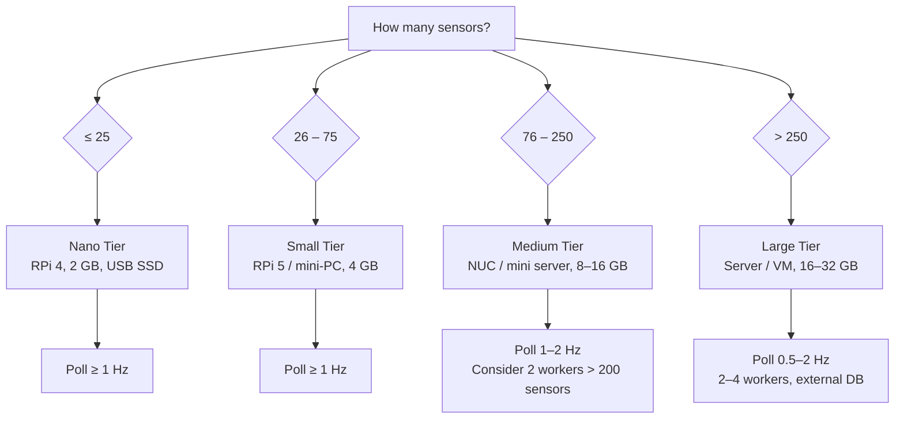

# Hardware & Sizing Recommendations

This guide helps you choose the right hardware for your WebMACS deployment based on the
number of sensors (input channels), desired poll frequency, and data retention requirements.

!!! info "How These Numbers Were Derived"
    All throughput and latency figures are extrapolated from load tests on a MacBook Pro
    (Apple M-series, single uvicorn worker, Docker Desktop). A hardware correction factor
    of **3–5×** for Raspberry Pi 4, **2–3×** for RPi 5 / entry-level mini-PCs, and
    **1.5×** for Intel NUC-class devices is applied.

---

## Quick Reference

| Tier | Hardware Example | RAM | Max Sensors | Max Frequency | Throughput | Est. Batch P95 |
|------|------------------|-----|-------------|---------------|------------|----------------|
| **Nano** | Raspberry Pi 4 | 2 GB | 25 | 1 Hz | 25 dp/s | < 100 ms |
| **Small** | Raspberry Pi 5 / mini-PC | 4 GB | 75 | 1 Hz | 75 dp/s | < 300 ms |
| **Medium** | Intel NUC / mini server | 8–16 GB | 250 | 1–2 Hz | 250–500 dp/s | < 400 ms |
| **Large** | Server / VM | 16–32+ GB | 500+ | 2 Hz | 1 000+ dp/s | < 550 ms |

!!! tip "dp/s = datapoints per second"
    `dp/s = sensors × frequency`. A system with 50 sensors polled at 2 Hz produces 100 dp/s.

---

## Load Test Baseline

Tested on Docker (MacBook Pro M-series), **single uvicorn worker**, PostgreSQL 17:

| Sensors | Frequency | dp/s | Batch P50 | Batch P95 | Dashboard P95 | Errors |
|---------|-----------|------|-----------|-----------|---------------|--------|
| 10 | 2 Hz | 20 | 12 ms | 17 ms | 43 ms | 0 % |
| 50 | 2 Hz | 100 | 27 ms | 228 ms | 44 ms | 0 % |
| 100 | 2 Hz | 200 | 43 ms | 243 ms | 46 ms | 0 % |
| 250 | 2 Hz | 500 | 92 ms | 353 ms | 52 ms | 0 % |
| 500 | 2 Hz | 1 000 | 186 ms | 532 ms | 83 ms | 0 % |

The ingestion pipeline per batch: **filter → bulk INSERT → webhooks (throttled) → rule evaluation (last value/event) → WebSocket broadcast (throttled)**.
Side-effects are sequential, so batch latency grows linearly with sensor count. Rule evaluation
is optimised to run once per unique event (not per datapoint).

---

## Tier Details

### Nano — Home Automation / Hobby

| Spec | Recommendation |
|------|----------------|
| **Hardware** | Raspberry Pi 4 Model B |
| **CPU** | ARM Cortex-A72, quad-core, 1.8 GHz |
| **RAM** | 2 GB |
| **Storage** | 32 GB+ **USB SSD** (avoid SD-only) |
| **Max sensors** | ≤ 25 |
| **Poll interval** | 1.0 s (1 Hz) — **do not go below** |
| **Throughput** | ≤ 25 dp/s |
| **Est. batch P95** | 50–100 ms |
| **Storage / month** | ~12 GB (see [formula](#storage-calculation)) |

??? example "Docker memory limits"
    ```yaml
    # docker-compose.prod.yml overrides for Nano
    db:        { deploy: { resources: { limits: { memory: 384M } } } }
    backend:   { deploy: { resources: { limits: { memory: 192M } } } }
    controller:{ deploy: { resources: { limits: { memory: 96M  } } } }
    frontend:  { deploy: { resources: { limits: { memory: 48M  } } } }
    ```

**Tuning tips:**

- **Use a USB 3.0 SSD** instead of the SD card for the PostgreSQL volume.
  SD cards throttle under sustained write I/O and wear out quickly.
- Set `WEBMACS_POLL_INTERVAL=1.0` or higher. At 2 Hz the batch latency budget
  (500 ms) will be consumed by the slower CPU.
- Keep active experiments short (hours, not months) — aggregate or export old data.
- Disable unused plugins to reduce per-poll overhead.
- Run `VACUUM ANALYZE` weekly via cron (see [Database Maintenance](#database-maintenance)).

---

### Small — Small Lab / Workshop

| Spec | Recommendation |
|------|----------------|
| **Hardware** | Raspberry Pi 5, ODROID-N2+, or entry mini-PC |
| **CPU** | ARM Cortex-A76 quad-core, 2.4 GHz (or comparable x86) |
| **RAM** | 4 GB |
| **Storage** | 64 GB+ NVMe hat or USB SSD |
| **Max sensors** | ≤ 75 |
| **Poll interval** | 1.0 s (1 Hz) |
| **Throughput** | ≤ 75 dp/s |
| **Est. batch P95** | 150–300 ms |
| **Storage / month** | ~36 GB |

??? example "Docker memory limits"
    ```yaml
    db:        { deploy: { resources: { limits: { memory: 512M } } } }
    backend:   { deploy: { resources: { limits: { memory: 256M } } } }
    controller:{ deploy: { resources: { limits: { memory: 128M } } } }
    frontend:  { deploy: { resources: { limits: { memory: 64M  } } } }
    ```

**Tuning tips:**

- An NVMe hat (RPi 5) or USB 3.2 SSD eliminates the storage bottleneck entirely.
- You can push to **2 Hz** with ≤ 30 sensors if latencies stay under 400 ms — monitor via
  the `/health` endpoint and application logs.
- Consider setting PostgreSQL `shared_buffers` to `128MB` (25 % of DB memory limit)
  via a custom `postgresql.conf` mount.
- Set up a nightly data retention job to delete or archive data older than your
  retention window (see [Data Retention](#data-retention)).

---

### Medium — Industrial Pilot

| Spec | Recommendation |
|------|----------------|
| **Hardware** | Intel NUC 12/13, Lenovo ThinkCentre Tiny, HP EliteDesk Mini |
| **CPU** | Intel Core i3/i5 (4–6 cores) or AMD Ryzen 5 |
| **RAM** | 8–16 GB |
| **Storage** | 256 GB+ NVMe SSD |
| **Max sensors** | ≤ 250 |
| **Poll interval** | 1.0 s (1 Hz), up to 2 Hz with ≤ 100 sensors |
| **Throughput** | 250–500 dp/s |
| **Est. batch P95** | 250–400 ms |
| **Storage / month** | ~120 GB (at 250 dp/s) |

??? example "Docker memory limits"
    ```yaml
    db:        { deploy: { resources: { limits: { memory: 2G   } } } }
    backend:   { deploy: { resources: { limits: { memory: 512M } } } }
    controller:{ deploy: { resources: { limits: { memory: 256M } } } }
    frontend:  { deploy: { resources: { limits: { memory: 64M  } } } }
    ```

**Tuning tips:**

- Increase PostgreSQL `shared_buffers` to `512MB` and `work_mem` to `8MB`.
- At > 200 sensors, consider adding a **second uvicorn worker** (see [Scaling Workers](#scaling-uvicorn-workers)).
- Enable `wal_compression = on` to reduce SSD write amplification.
- Set up automated backups with `pg_dump` + off-device copy (NAS, S3, etc.).
- Mount PostgreSQL data on a dedicated NVMe partition for I/O isolation.
- For 2 Hz polling with 100+ sensors, enable **batch compression** by grouping
  poll intervals if supported by your plugin.

---

### Large — Production Plant

| Spec | Recommendation |
|------|----------------|
| **Hardware** | Rack server, tower server, or cloud VM (AWS, GCP, Azure) |
| **CPU** | Intel Xeon / AMD EPYC, 8+ cores |
| **RAM** | 16–32+ GB |
| **Storage** | 512 GB+ NVMe SSD, RAID-1 recommended |
| **Max sensors** | 500+ |
| **Poll interval** | 0.5–2.0 s (adjust per workload) |
| **Throughput** | 1 000+ dp/s |
| **Est. batch P95** | < 550 ms |
| **Storage / month** | ~480 GB (at 1 000 dp/s) |

??? example "Docker memory limits"
    ```yaml
    db:        { deploy: { resources: { limits: { memory: 8G   } } } }
    backend:   { deploy: { resources: { limits: { memory: 1G   } } } }
    controller:{ deploy: { resources: { limits: { memory: 512M } } } }
    frontend:  { deploy: { resources: { limits: { memory: 128M } } } }
    ```

**Tuning tips:**

- Use **2–4 uvicorn workers** — see [Scaling Workers](#scaling-uvicorn-workers).
- Strongly consider an **external / dedicated PostgreSQL** instance
  (see [External PostgreSQL](#external-postgresql)).
- Set `shared_buffers` to 25 % of total DB RAM (`2G` for 8 GB limit).
- Configure `max_connections = 200` and use connection pooling (PgBouncer).
- At this scale, set up **table partitioning** on the datapoints table by time range
  (weekly or monthly) for fast `DROP PARTITION` instead of `DELETE`.
- Enable WAL archiving and point-in-time recovery (PITR).
- Set up monitoring (Prometheus + Grafana) for PostgreSQL and container metrics.
- For multi-machine setups, split the database onto a separate host and use
  `DATABASE_URL` to point to it.

---

## Fast Mode (Sub-Second Polling)

WebMACS supports poll intervals as low as **200 ms** (5 Hz) for use cases that require
near-real-time sensor readings — e.g. PID control loops, vibration monitoring, or
high-speed process capture.

!!! warning "Fast mode is an advanced feature"
    Sub-second polling multiplies CPU, memory, storage, and network load proportionally.
    Only use it when your application genuinely requires it, and always validate
    with a load test on your target hardware first.

### Configuration

Set the poll interval via environment variable:

```bash
# In .env or docker-compose.prod.yml
WEBMACS_POLL_INTERVAL=0.5   # 500 ms → 2 Hz
WEBMACS_POLL_INTERVAL=0.2   # 200 ms → 5 Hz (minimum allowed)
```

Additional tuning knobs:

| Variable | Default | Description |
|----------|---------|-------------|
| `WEBMACS_POLL_INTERVAL` | `1.0` | Seconds between sensor reads (min `0.2`) |
| `WEBMACS_MAX_BATCH_SIZE` | `100` | Max datapoints per telemetry payload (1–500) |
| `WEBMACS_DEDUP_ENABLED` | `false` | Drop unchanged sensor values to reduce I/O |

### Built-in Safeguards

The controller and backend apply several safeguards automatically when fast
polling is active:

| Layer | Safeguard | Effect |
|-------|-----------|--------|
| **Controller** | Per-sensor throttle | Each channel is read at most once per `poll_interval`, even if the loop runs faster |
| **Controller** | Optional dedup | Unchanged values are dropped (enable with `WEBMACS_DEDUP_ENABLED=true`) |
| **Controller** | Batch chunking | Oversized batches are split to ≤ `max_batch_size` before transmission |
| **Controller** | 429 retry | Backend rate-limiting triggers automatic backoff with `Retry-After` support |
| **Backend** | Batch size cap | REST and WebSocket endpoints reject batches > 500 datapoints |
| **Backend** | Rule-eval optimisation | Multiple readings per event in a single batch → only the last value triggers rules |
| **Backend** | Broadcast throttle | Frontend WebSocket broadcasts are limited to ≥ 200 ms per event |

### Tier Limits for Fast Mode

| Tier | Max Sensors at 5 Hz | Max Sensors at 2 Hz | Notes |
|------|---------------------|---------------------|-------|
| **Nano** | ❌ Not recommended | 10 | CPU becomes the bottleneck |
| **Small** | 10 | 30 | Enable dedup to reduce write load |
| **Medium** | 50 | 100 | Consider 2 workers at > 200 dp/s |
| **Large** | 100+ | 250+ | External PostgreSQL strongly recommended |

### Storage Impact

Sub-second polling dramatically increases storage consumption:

| Sensors | Frequency | dp/s | Storage / Month |
|---------|-----------|------|-----------------|
| 20 | 2 Hz | 40 | 20 GB |
| 50 | 2 Hz | 100 | 48 GB |
| 50 | 5 Hz | 250 | 120 GB |
| 100 | 5 Hz | 500 | 240 GB |

Enable **dedup** (`WEBMACS_DEDUP_ENABLED=true`) for sensors that change infrequently
(e.g. digital I/O, setpoints) to significantly reduce write volume.

---

## Storage Calculation

### Formula

$$
\text{Storage (GB/month)} \approx \text{dp/s} \times 0.5
$$

This accounts for approximately **200 bytes per datapoint row** (value, timestamp,
foreign keys, and B-tree index overhead) at continuous 24/7 ingestion:

$$
\text{dp/s} \times 86\,400 \;\text{s/day} \times 30 \;\text{days} \times 200 \;\text{B}
= \text{dp/s} \times 518\,400\,000 \;\text{B}
\approx \text{dp/s} \times 0.48 \;\text{GB}
$$

### Quick Lookup

| dp/s | Per Day | Per Month | Per Year |
|------|---------|-----------|----------|
| 10 | 165 MB | 4.8 GB | 58 GB |
| 25 | 410 MB | 12 GB | 144 GB |
| 50 | 820 MB | 24 GB | 288 GB |
| 100 | 1.6 GB | 48 GB | 576 GB |
| 250 | 4.1 GB | 120 GB | 1.4 TB |
| 500 | 8.2 GB | 240 GB | 2.9 TB |
| 1 000 | 16.4 GB | 480 GB | 5.8 TB |

!!! warning "SD Card Warning"
    Continuous database writes **will degrade SD cards** within weeks to months.
    Always use an SSD for the PostgreSQL data volume on any tier.

### Reducing Storage Consumption

- **Lower poll frequency** — 0.5 Hz instead of 1 Hz halves storage.
- **Data retention** — Delete or archive data older than N days (see below).
- **Selective sensors** — Only enable events/sensors you actually need.
- **Aggregation** — Export raw data to CSV periodically, keep only summaries in the DB.

---

## Scaling Uvicorn Workers

WebMACS runs a **single uvicorn worker** by default (single async event loop).
This is sufficient for most deployments up to ~200–300 dp/s.

### When to Add Workers

| Signal | Action |
|--------|--------|
| Batch P95 latency consistently > 400 ms | Add 1 worker |
| Dashboard P95 > 200 ms (sluggish UI) | Add 1 worker |
| CPU usage of backend container > 80 % | Add 1–2 workers |
| Sensor count > 200 at 1 Hz | Consider 2 workers |
| Sensor count > 500 | Use 2–4 workers |

### How to Configure

Override the backend entrypoint in `docker-compose.prod.yml`:

```yaml
backend:
  command: >
    uvicorn webmacs_backend.main:app
    --host 0.0.0.0
    --port 8000
    --workers 2
```

!!! note "Rule of thumb"
    **Workers = min(CPU cores, 4)**. More workers share the same database connection pool,
    so increase `max_connections` in PostgreSQL accordingly (workers × 20).

---

## External PostgreSQL

The default setup runs PostgreSQL inside Docker on the same machine. This is simple and
sufficient for Nano–Medium tiers. Consider a dedicated PostgreSQL when:

| Signal | Recommendation |
|--------|----------------|
| dp/s > 500 sustained | Dedicated host or managed database |
| Data retention > 6 months at > 100 dp/s | Dedicated host with large SSD |
| High availability required | Managed cloud PostgreSQL (RDS, Cloud SQL) |
| Multiple WebMACS instances reporting to one DB | Dedicated shared PostgreSQL |

### Migration Path

1. Provision a PostgreSQL 17 instance (managed or self-hosted).
2. Create the `webmacs` database and user.
3. Run a `pg_dump` / `pg_restore` from the Docker container to the new instance.
4. Update `DATABASE_URL` in `.env` to point to the external host.
5. Remove or stop the `db` service in `docker-compose.prod.yml`.
6. Run Alembic migrations: `alembic upgrade head`.

---

## Database Maintenance

### VACUUM & ANALYZE

PostgreSQL requires periodic maintenance to reclaim dead rows and update query planner statistics.

```bash
# Manual run (inside the db container)
docker compose exec db psql -U webmacs -c "VACUUM ANALYZE;"
```

**Recommended schedule:**

| Tier | autovacuum | Manual VACUUM FULL |
|------|------------|---------------------|
| Nano | Default (on) | Monthly |
| Small | Default (on) | Monthly |
| Medium | Tune thresholds ([see below](#autovacuum-tuning)) | Quarterly |
| Large | Tune thresholds | Quarterly, during maintenance window |

#### Autovacuum Tuning (Medium / Large)

Mount a custom `postgresql.conf` or pass via environment variables:

```ini
# More aggressive autovacuum for high-write workloads
autovacuum_vacuum_scale_factor = 0.05    # default 0.2
autovacuum_analyze_scale_factor = 0.02   # default 0.1
autovacuum_vacuum_cost_delay = 2ms       # default 2ms (keep)
autovacuum_max_workers = 3               # default 3 (increase for Large)
```

### Data Retention

For long-running deployments, purge old datapoints to keep the database lean:

```bash
# Delete datapoints older than 90 days
docker compose exec db psql -U webmacs -c \
  "DELETE FROM datapoints WHERE timestamp < NOW() - INTERVAL '90 days';"

# Then reclaim disk space
docker compose exec db psql -U webmacs -c "VACUUM FULL datapoints;"
```

!!! tip "Automate with cron"
    ```cron
    # Every Sunday at 03:00 — delete data older than 90 days and vacuum
    0 3 * * 0 docker compose -f /opt/webmacs/docker-compose.prod.yml exec -T db \
      psql -U webmacs -c "DELETE FROM datapoints WHERE timestamp < NOW() - INTERVAL '90 days'; VACUUM ANALYZE datapoints;"
    ```

### Index Maintenance

The composite index `(event_public_id, timestamp)` is the primary performance driver for
dashboard queries. After large DELETE operations, rebuild it:

```bash
docker compose exec db psql -U webmacs -c \
  "REINDEX INDEX CONCURRENTLY idx_datapoints_event_timestamp;"
```

---

## Decision Flowchart



---

## Summary: Choosing Your Tier

1. **Count your sensors** (input channels across all events).
2. **Decide your poll frequency** (1 Hz is fine for most use cases).
3. **Calculate dp/s** = sensors × frequency.
4. **Pick the tier** from the Quick Reference table above.
5. **Estimate storage** with the formula: `dp/s × 0.5 GB/month`.
6. **Plan retention** — how many months of raw data do you need?

When in doubt, start one tier up from your estimate. It's easier to run
a system with headroom than to migrate under pressure.
