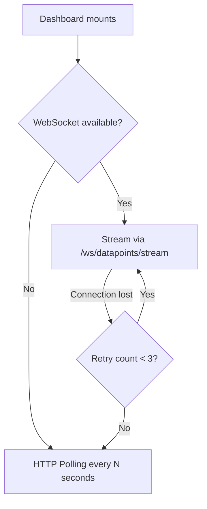

# Dashboard

The Dashboard is the primary view for real-time sensor monitoring. It displays live datapoint values and updates automatically.

---

## Real-Time Data

WebMACS uses a **WebSocket-first, HTTP-fallback** strategy:



### Connection Indicator

| Icon | Mode | Meaning |
|---|---|---|
| :material-web: Green | WebSocket | Live streaming active |
| :material-sync: Amber | Polling | Fallback — WebSocket unavailable |
| :material-close-circle: Red | Disconnected | No connection to backend |

---

## WebSocket Transport

The frontend connects to:

```
ws://localhost:8000/ws/datapoints/stream
```

Messages arrive as JSON:

```json
{
  "public_id": "dp_abc123",
  "value": 23.45,
  "timestamp": "2025-01-15T14:32:10.000Z",
  "event_public_id": "evt_temp01",
  "experiment_public_id": "exp_001"
}
```

When the WebSocket connection drops, the `useRealtimeDatapoints` composable automatically switches to HTTP polling after 3 failed reconnection attempts.

---

## HTTP Polling Fallback

In polling mode the frontend calls:

```
GET /api/v1/datapoints?limit=50
```

at a configurable interval (default: 2 seconds).

---

## Configuration

| Setting | Type | Default | Description |
|---|---|---|---|
| Poll interval | Frontend | 2 s | Time between HTTP polls in fallback mode |
| WS heartbeat | Backend | 30 s | Server-side heartbeat to keep WS alive |
| Max retries | Frontend | 3 | WS reconnection attempts before switching to polling |

---

## Next Steps

- [Events & Sensors](events.md) — what data feeds the dashboard
- [Architecture: WebSocket Design](../architecture/websocket.md) — full protocol details
