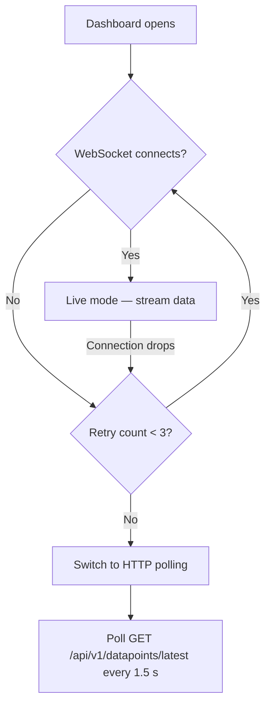

# Dashboard

The Dashboard is your primary control centre. It shows live sensor readings, lets you toggle actuators, adjust range controls, and displays a real-time chart — all updating in real time.

---

## At a Glance

When you open the Dashboard you see four sections:

| Section | What It Shows |
|---|---|
| **Stats bar** | Total sensor count, actuator count, range control count, and connection status |
| **Sensor cards** | One card per sensor with current value, unit, and min/max range indicator |
| **Actuator controls** | ON / OFF toggle for each actuator |
| **Range controls** | Adjustable slider for each range-type event |
| **Live chart** | Scrolling line chart with the last 60 readings per sensor |

---

## Connection Status

The stats bar shows how data is being received:

| Indicator | Mode | Meaning |
|---|---|---|
| :material-web: **Live** (green) | WebSocket | Data streams in real time — best experience |
| :material-sync: **Poll** (amber) | HTTP Polling | WebSocket unavailable, polling every 1.5 s |
| :material-loading: **Connecting** | — | Establishing connection |

!!! tip "Connection tips"
    - **Live** mode is the default and recommended. Data appears instantly.
    - If you see **Poll** mode, check that the backend WebSocket endpoint is reachable. The system switches to polling automatically after 3 failed WebSocket reconnection attempts.

### How Automatic Fallback Works



---

## Sensor Cards

Each sensor event gets its own card displaying:

- **Name** — the sensor label (e.g. "Inlet Temperature")
- **Current value** — large, easy-to-read number
- **Unit** — measurement unit (°C, bar, L/min, …)
- **Range bar** — visual min/max indicator showing where the current value falls

Values update automatically whenever new data arrives via the real-time connection.

---

## Actuator Controls

Each actuator event is shown as an **ON / OFF toggle button**. Toggling sends a datapoint with value `1` (ON) or `0` (OFF) to the backend, which the IoT controller picks up to switch hardware outputs.

!!! warning "Actuators affect physical hardware"
    Toggling an actuator immediately sends a command to the controller. Make sure the connected equipment is in a safe state before switching.

---

## Range Controls

Range events appear as **sliders** bounded by the event's `min_value` and `max_value`. Dragging the slider sends the selected value as a new datapoint.

Use range controls for setpoints like target temperatures, flow rates, or motor speeds.

---

## Live Chart

The bottom section shows a scrolling line chart powered by Chart.js:

- **One line per sensor** — up to 8 colours are cycled automatically
- **Last 60 data points** per sensor
- **Smooth curves** — filled area under each line for easy visual separation
- **Auto-scrolling** — oldest data drops off the left edge as new data arrives

The chart updates every time a new datapoint batch is received.

!!! info "Chart visibility"
    The live chart section only appears when at least one sensor event exists.

---

## Typical Workflow

1. **Create events** — go to [Events & Sensors](events.md) and define your sensors, actuators, and range controls
2. **Start the controller** — the IoT controller reads hardware and pushes datapoints to the backend
3. **Open the Dashboard** — sensor cards fill with live values, the chart starts plotting
4. **Interact** — toggle actuators, adjust range sliders, monitor trends
5. **(Optional) Start an experiment** — go to [Experiments](experiments.md) to begin grouping datapoints

---

## Configuration Reference

| Setting | Where | Default | Description |
|---|---|---|---|
| Poll interval | Frontend composable | 1.5 s | Time between HTTP polls in fallback mode |
| WS heartbeat | Backend config | 30 s | Server-side ping to keep WebSocket alive |
| Max WS retries | Frontend composable | 3 | Reconnection attempts before switching to polling |

---

## Custom Dashboards

!!! success "Build your own monitoring view"
    The system dashboard above shows everything at once. **Custom dashboards**
    let you build purpose-built views with only the widgets you need — one for
    the reactor, one for the cooling loop, one for the client demo.

### Creating a Dashboard

1. Navigate to **Dashboards** in the sidebar
2. Click **New Dashboard**
3. Enter a name (e.g., "Reactor Zone A")
4. Optionally check **"Visible to all users"** to make it a global dashboard
5. Click **Create**

!!! info "Visibility"
    Each user sees their own dashboards plus any dashboard marked as **global**.
    Only the dashboard owner can edit or delete it.

### Widget Types

Click **Add Widget** to choose from four types:

| Widget | Type | Purpose | Refresh Rate |
|---|---|---|---|
| :material-chart-line: **Line Chart** | `line_chart` | Time-series trend for any sensor | 5 seconds |
| :material-gauge: **Gauge** | `gauge` | Radial meter with colour coding (green/yellow/red) | 3 seconds |
| :material-card-text: **Stat Card** | `stat_card` | Large current value with label and unit | 3 seconds |
| :material-toggle-switch: **Actuator Toggle** | `actuator_toggle` | ON/OFF button for valves, relays, motors | 3 seconds |

Each widget connects to a **sensor event** and refreshes automatically via HTTP
polling at the rate shown above.

### Size Presets

When adding a widget, pick a size:

| Preset | Columns | Rows | Good For |
|---|---|---|---|
| Small | 3 | 2 | Stat cards, toggles |
| Medium | 4 | 3 | Gauges |
| Wide | 6 | 3 | Charts with moderate detail |
| Large | 6 | 4 | Primary charts |
| Full Width | 12 | 4 | Full-width trend lines |

The dashboard uses a **12-column CSS grid** with 80 px row height. Widgets
flow automatically into available space.

### Grid Layout Example

```
┌──────────────┬──────────────┬──────────────┐
│  Stat Card   │  Stat Card   │    Gauge     │
│  (3 col)     │  (3 col)     │   (3 col)   │
├──────────────┴──────────────┼──────────────┤
│         Line Chart          │   Actuator   │
│         (6 col, 2 rows)     │   Toggle     │
│                             │   (3 col)    │
└─────────────────────────────┴──────────────┘
```

### Edit & Lock Mode

- Click **Edit** to reveal pencil and trash icons on each widget
- Click **Lock** to hide edit controls and prevent accidental changes
- Widgets can be edited (change title, data source, size) or deleted with a
  two-step confirmation

### Time Range Selector

Each custom dashboard has a **time range selector** with six presets:

| Preset | Minutes | Typical Use |
|---|---|---|
| 20 min | 20 | Live troubleshooting |
| 1 hour | 60 | Short experiment |
| 6 hours | 360 | Half-shift monitoring |
| 24 hours | 1440 | Daily overview |
| 7 days | 10080 | Weekly trends |
| 10 days | 14400 | Extended campaign |

The selected range is remembered per dashboard in your browser and synced to
the URL (`?range=60`), so you can bookmark a specific view.

### Managing via API

```bash
# Create a dashboard
curl -X POST http://localhost:8000/api/v1/dashboards \
  -H "Authorization: Bearer $TOKEN" \
  -H "Content-Type: application/json" \
  -d '{"name": "Reactor Overview", "is_global": false}'

# Add a line chart widget
curl -X POST http://localhost:8000/api/v1/dashboards/$DASH_ID/widgets \
  -H "Authorization: Bearer $TOKEN" \
  -H "Content-Type: application/json" \
  -d '{
    "widget_type": "line_chart",
    "title": "Inlet Temperature",
    "event_public_id": "evt_abc123",
    "x": 0, "y": 0, "w": 6, "h": 3
  }'

# List all dashboards
curl http://localhost:8000/api/v1/dashboards \
  -H "Authorization: Bearer $TOKEN"
```

### Example: Reactor Monitoring Dashboard

1. Create dashboard **"Reactor Zone A"**
2. Add a `stat_card` (Small) → "Inlet Temp" sensor
3. Add a `stat_card` (Small) → "Outlet Temp" sensor
4. Add a `gauge` (Medium) → "Pressure" sensor
5. Add an `actuator_toggle` (Small) → "Emergency Valve"
6. Add a `line_chart` (Full Width) → "Inlet Temp" sensor

**Result:** A single-screen view with live values, a safety gauge, an emergency
control, and a trend line — all updating automatically every few seconds.

---

## Next Steps

- [Integrations & Extensibility](integrations.md) — connect WebMACS to Slack, Node-RED, and more
- [Events & Sensors](events.md) — define what data feeds the dashboard
- [Experiments](experiments.md) — start grouping data into experiments
- [Automation Rules](rules.md) — get alerted when values cross thresholds
