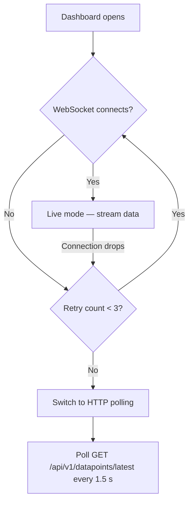

# Dashboard

The Dashboard is your primary control centre. It shows live sensor readings, lets you toggle actuators, adjust range controls, and displays a real-time chart — all updating in real time.

---

## At a Glance

When you open the Dashboard you see four sections:

| Section | What It Shows |
|---|---|
| **Stats bar** | Total sensor count, actuator count, range control count, and connection status |
| **Sensor cards** | One card per sensor with current value, unit, and min/max range indicator |
| **Actuator controls** | ON / OFF toggle for each actuator |
| **Range controls** | Adjustable slider for each range-type event |
| **Live chart** | Scrolling line chart with the last 60 readings per sensor |

---

## Connection Status

The stats bar shows how data is being received:

| Indicator | Mode | Meaning |
|---|---|---|
| :material-web: **Live** (green) | WebSocket | Data streams in real time — best experience |
| :material-sync: **Poll** (amber) | HTTP Polling | WebSocket unavailable, polling every 1.5 s |
| :material-loading: **Connecting** | — | Establishing connection |

!!! tip "Connection tips"
    - **Live** mode is the default and recommended. Data appears instantly.
    - If you see **Poll** mode, check that the backend WebSocket endpoint is reachable. The system switches to polling automatically after 3 failed WebSocket reconnection attempts.

### How Automatic Fallback Works

---

## Sensor Cards

Each sensor event gets its own card displaying:

- **Name** — the sensor label (e.g. "Inlet Temperature")
- **Current value** — large, easy-to-read number
- **Unit** — measurement unit (°C, bar, L/min, …)
- **Range bar** — visual min/max indicator showing where the current value falls

Values update automatically whenever new data arrives via the real-time connection.

---

## Actuator Controls

Each actuator event is shown as an **ON / OFF toggle button**. Toggling sends a datapoint with value `1` (ON) or `0` (OFF) to the backend, which the IoT controller picks up to switch hardware outputs.

!!! warning "Actuators affect physical hardware"
    Toggling an actuator immediately sends a command to the controller. Make sure the connected equipment is in a safe state before switching.

---

## Range Controls

Range events appear as **sliders** bounded by the event's `min_value` and `max_value`. Dragging the slider sends the selected value as a new datapoint.

Use range controls for setpoints like target temperatures, flow rates, or motor speeds.

---

## Live Chart

The bottom section shows a scrolling line chart powered by Chart.js:

- **One line per sensor** — up to 8 colours are cycled automatically
- **Last 60 data points** per sensor
- **Smooth curves** — filled area under each line for easy visual separation
- **Auto-scrolling** — oldest data drops off the left edge as new data arrives

The chart updates every time a new datapoint batch is received.

!!! info "Chart visibility"
    The live chart section only appears when at least one sensor event exists.

---

## Typical Workflow

1. **Create events** — go to [Events & Sensors](events.md) and define your sensors, actuators, and range controls
2. **Start the controller** — the IoT controller reads hardware and pushes datapoints to the backend
3. **Open the Dashboard** — sensor cards fill with live values, the chart starts plotting
4. **Interact** — toggle actuators, adjust range sliders, monitor trends
5. **(Optional) Start an experiment** — go to [Experiments](experiments.md) to begin grouping datapoints

---

## Configuration Reference

| Setting | Where | Default | Description |
|---|---|---|---|
| Poll interval | Frontend composable | 1.5 s | Time between HTTP polls in fallback mode |
| WS heartbeat | Backend config | 30 s | Server-side ping to keep WebSocket alive |
| Max WS retries | Frontend composable | 3 | Reconnection attempts before switching to polling |

---

## Next Steps

- [Events & Sensors](events.md) — define what data feeds the dashboard
- [Experiments](experiments.md) — start grouping data into experiments
- [Automation Rules](rules.md) — get alerted when values cross thresholds
