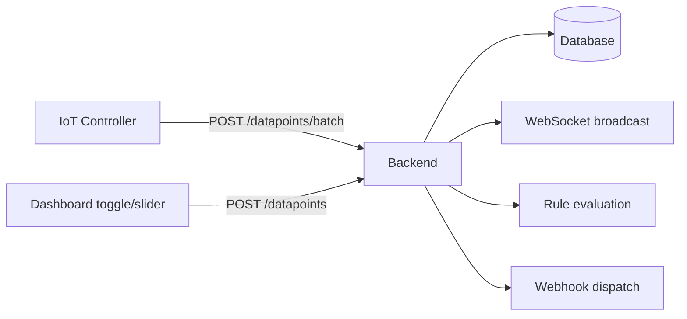

# Datapoints

Datapoints are the raw data stream of WebMACS. Every sensor reading, actuator command, and range adjustment is stored as a datapoint — a timestamped value linked to an [event](events.md) and optionally to an [experiment](experiments.md).

---

## What Is a Datapoint?

| Field | Description |
|---|---|
| **Value** | The measured or commanded value (float) |
| **Timestamp** | When the reading was recorded (UTC) |
| **Event** | Which sensor/actuator produced this value |
| **Experiment** | The running experiment at the time (if any) |
| **Public ID** | Unique identifier |

---

## How Datapoints Are Created

Datapoints are created automatically by the system — you rarely create them manually.



| Source | How | Description |
|---|---|---|
| **Controller** | `POST /api/v1/datapoints/batch` | Pushes sensor readings every ~0.5 s |
| **Dashboard** | `POST /api/v1/datapoints` | Actuator toggles and range slider changes |
| **API client** | `POST /api/v1/datapoints` | External systems can push data too |

### What Happens on Each Datapoint

When a new datapoint arrives, the backend:

1. **Persists** it to the database
2. **Links to active experiment** — if an experiment is running, the datapoint is associated automatically
3. **Evaluates rules** — all enabled [automation rules](rules.md) for the event are checked
4. **Fires webhooks** — `sensor.reading` webhooks are dispatched
5. **Broadcasts** — the value is pushed to all connected browser dashboards via WebSocket

---

## Browsing Datapoints

### Via the UI

Navigate to **Datapoints** in the sidebar to see a paginated table of all recorded values:

| Column | Description |
|---|---|
| **Public ID** | Unique identifier |
| **Event** | Sensor/actuator name |
| **Value** | Measured value |
| **Created** | Timestamp |

The table shows a total count badge and is paginated.

### Via the API

```bash
# List datapoints (paginated, newest first)
curl http://localhost:8000/api/v1/datapoints?page=1&page_size=50 \
  -H "Authorization: Bearer $TOKEN"

# Get the latest reading per event (used by the Dashboard)
curl http://localhost:8000/api/v1/datapoints/latest \
  -H "Authorization: Bearer $TOKEN"

# Get a single datapoint
curl http://localhost:8000/api/v1/datapoints/$DP_ID \
  -H "Authorization: Bearer $TOKEN"
```

---

## Creating Datapoints via API

### Single Datapoint

```bash
curl -X POST http://localhost:8000/api/v1/datapoints \
  -H "Authorization: Bearer $TOKEN" \
  -H "Content-Type: application/json" \
  -d '{
    "value": 23.45,
    "event_public_id": "evt_temp_inlet"
  }'
```

### Batch (Multiple Datapoints)

```bash
curl -X POST http://localhost:8000/api/v1/datapoints/batch \
  -H "Authorization: Bearer $TOKEN" \
  -H "Content-Type: application/json" \
  -d '{
    "datapoints": [
      {"value": 23.45, "event_public_id": "evt_temp_inlet"},
      {"value": 1.05, "event_public_id": "evt_pressure_01"},
      {"value": 4.2, "event_public_id": "evt_flow_rate"}
    ]
  }'
```

!!! tip "Use batch for performance"
    The batch endpoint is significantly more efficient than individual POSTs when sending multiple readings at once. The IoT controller uses this by default.

---

## Deleting Datapoints

```bash
curl -X DELETE http://localhost:8000/api/v1/datapoints/$DP_ID \
  -H "Authorization: Bearer $TOKEN"
```

!!! warning "Deletion is permanent"
    Deleted datapoints cannot be recovered. Consider [CSV export](csv-export.md) before deleting experiment data.

---

## Data Volume

In a typical setup with 7 sensors reading every 0.5 seconds:

| Period | Datapoints |
|---|---|
| 1 minute | ~840 |
| 1 hour | ~50,400 |
| 24 hours | ~1.2 million |
| 1 week | ~8.5 million |

WebMACS handles this volume efficiently with streaming CSV export and paginated API responses.

---

## Next Steps

- [Dashboard](dashboard.md) — see datapoints visualised in real time
- [Experiments](experiments.md) — group datapoints into time-bounded experiments
- [CSV Export](csv-export.md) — download experiment data for analysis
- [API Reference](../api/rest.md) — full datapoints endpoint documentation
