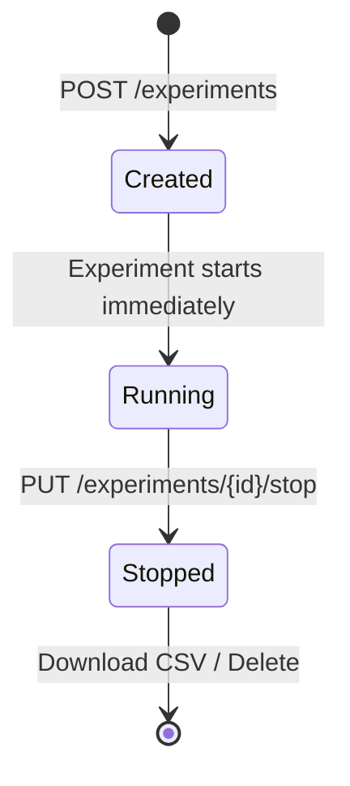

# Experiments

Experiments let you group datapoints into time-bounded runs. While an experiment is active, every datapoint recorded by the system is automatically linked to it. When you stop the experiment, you can download all associated data as a CSV file.

---

## Lifecycle



!!! info "One experiment at a time"
    Only **one experiment** can be running at any time. Starting a new experiment requires stopping the current one first.

---

## What Happens During an Experiment?

1. **Create** — you give the experiment a name. It starts running immediately (`started_on` is set automatically).
2. **Data collection** — every datapoint pushed by the controller is automatically tagged with the experiment's ID. You don't need to do anything.
3. **Stop** — you stop the experiment. `stopped_on` is recorded. No more datapoints are linked.
4. **Export** — download all linked datapoints as a [CSV file](csv-export.md).

---

## Using the UI

### Creating an Experiment

1. Navigate to **Experiments** in the sidebar
2. Click **New Experiment**
3. Enter a descriptive name (e.g. "Fluidised Bed Run 07 — 200°C")
4. Click **Create**

The experiment starts running immediately. You will see it in the table with a green **Running** badge.

### Stopping an Experiment

Click the :material-stop: **Stop** button on a running experiment. The badge changes to **Stopped** and the stop timestamp is recorded.

### Downloading Data

Click the :material-download: **CSV** button on a stopped experiment to download all datapoints. See [CSV Export](csv-export.md) for format details.

### Deleting an Experiment

Click the :material-delete: **Delete** button and confirm. This permanently removes the experiment **and all its linked datapoints**.

!!! danger "Deletion is permanent"
    Deleting an experiment also deletes every datapoint associated with it. Export to CSV first if you need the data.

---

## Experiment Table Columns

| Column | Description |
|---|---|
| **Name** | Experiment label |
| **Status** | :material-play-circle: Running (green) or :material-stop-circle: Stopped (grey) |
| **Started** | Timestamp when the experiment was created |
| **Stopped** | Timestamp when the experiment was stopped (empty if still running) |
| **Actions** | CSV download, Stop, Delete |

---

## Using the API

### Create an Experiment

```bash
curl -X POST http://localhost:8000/api/v1/experiments \
  -H "Authorization: Bearer $TOKEN" \
  -H "Content-Type: application/json" \
  -d '{"name": "Fluidised Bed Run 07"}'
```

Returns the experiment with `started_on` already set.

### List Experiments

```bash
curl http://localhost:8000/api/v1/experiments \
  -H "Authorization: Bearer $TOKEN"
```

Supports `?page=1&page_size=50` pagination.

### Stop an Experiment

```bash
curl -X PUT http://localhost:8000/api/v1/experiments/$EXP_ID/stop \
  -H "Authorization: Bearer $TOKEN"
```

### Download CSV

```bash
curl -o results.csv \
  http://localhost:8000/api/v1/experiments/$EXP_ID/export/csv \
  -H "Authorization: Bearer $TOKEN"
```

### Delete an Experiment

```bash
curl -X DELETE http://localhost:8000/api/v1/experiments/$EXP_ID \
  -H "Authorization: Bearer $TOKEN"
```

---

## Best Practices

!!! tip "Recommendations"
    - **Name experiments descriptively** — include parameters, date, or batch number (e.g. "Run 12 — Inlet 180°C, Flow 5 L/min")
    - **Export CSV before deleting** — deletion is irreversible and removes all linked datapoints
    - **Stop experiments promptly** — a running experiment captures *all* data, including calibration or idle readings you may not want

---

## Next Steps

- [CSV Export](csv-export.md) — download and analyse experiment data
- [Events & Sensors](events.md) — configure the sensors that feed experiments
- [Dashboard](dashboard.md) — monitor the live data while an experiment runs
