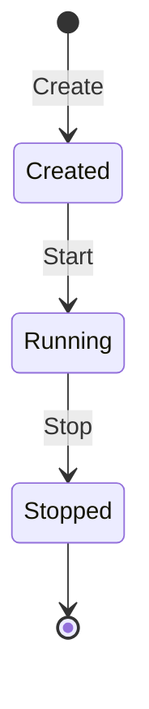

# Experiments

Experiments group datapoints in time. Every datapoint collected while an experiment is running is automatically linked to that experiment.

---

## Lifecycle



---

## Creating an Experiment

1. Navigate to **Experiments** in the sidebar
2. Click **New Experiment**
3. Enter a descriptive name
4. Click **Create**

The experiment is created but not yet started.

---

## Starting & Stopping

| Action | API Endpoint | Effect |
|---|---|---|
| Start | `POST /api/v1/experiments` | Sets `started_on`, begins associating new datapoints |
| Stop | `PUT /api/v1/experiments/{id}` | Sets `stopped_on`, stops association |

Only **one experiment** can be running at a time.

---

## Viewing Results

The Experiments page shows:

- Experiment name
- Start / stop timestamps
- Number of associated datapoints
- **CSV download** button (see [CSV Export](csv-export.md))

---

## API Examples

### Create & Start

```bash
curl -X POST http://localhost:8000/api/v1/experiments \
  -H "Authorization: Bearer $TOKEN" \
  -H "Content-Type: application/json" \
  -d '{"name": "Fluidised Bed Run 07"}'
```

### Stop

```bash
curl -X PUT http://localhost:8000/api/v1/experiments/$EXP_ID \
  -H "Authorization: Bearer $TOKEN" \
  -H "Content-Type: application/json" \
  -d '{"stopped_on": "2025-01-15T16:00:00Z"}'
```

---

## Next Steps

- [CSV Export](csv-export.md) — download experiment data
- [API Reference](../api/rest.md) — full endpoint documentation
