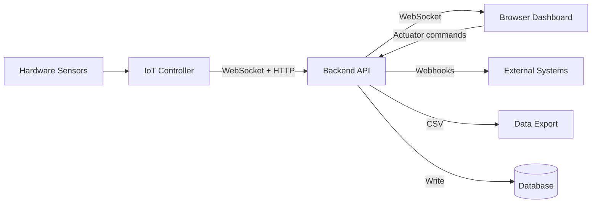

# User Guide

Welcome to the WebMACS User Guide. This section explains every feature of the platform — from live sensor monitoring to automated alerting and data export.

WebMACS (**Web-based Monitoring and Control System**) is designed for operators who need to monitor industrial sensors, control actuators, run timed experiments, and export data — all from a browser.

---

## What Can I Do with WebMACS?

| Feature | What It Does |
|---|---|
| :material-monitor-dashboard: [Dashboard](dashboard.md) | See all sensor values live, toggle actuators, adjust range controls, view a real-time chart |
| :material-view-dashboard-variant: [Custom Dashboards](dashboard.md#custom-dashboards) | **Build your own monitoring views** — pick from line charts, gauges, stat cards, and actuator toggles, place them on a 12-column grid with size presets, connect each widget to a live sensor. Create as many dashboards as you need — one per zone, process, or team. No code required. |
| :material-format-list-bulleted: [Events & Sensors](events.md) | Define sensors, actuators, and range controls that the controller reads from hardware |

  <video controls playsinline muted width="100%" style="border-radius: 8px; box-shadow: 0 2px 12px rgba(0,0,0,0.15);">
    <source src="../videos/feature-custom-dashboard.mp4" type="video/mp4">
    Your browser does not support the video tag.
  </video>
  <figcaption style="text-align: center; margin-top: 0.5rem; color: var(--md-default-fg-color--light); font-size: 0.85rem;">:material-play-circle: Custom Dashboard in action — create, resize, and monitor in real time</figcaption>

| :material-flask: [Experiments](experiments.md) | Group datapoints into time-bounded experiments for later analysis |
| :material-database: [Datapoints](datapoints.md) | Browse the raw data stream collected from every sensor |
| :material-alert: [Automation Rules](rules.md) | Trigger alerts or webhooks when sensor values exceed thresholds |
| :material-webhook: [Webhooks](webhooks.md) | Push HMAC-signed events to Slack, Teams, Node-RED, Home Assistant — or any HTTP endpoint |
| :material-puzzle: [Integrations](integrations.md) | Connect WebMACS to anything: REST API + WebSocket + webhooks — your Swiss army knife for lab data |
| :material-file-delimited: [CSV Export](csv-export.md) | Download experiment data as a spreadsheet-ready CSV file |
| :material-update: [OTA Updates](ota.md) | Update the system firmware over the network |
| :material-text-box: [Logs](logs.md) | View system log entries (info, warnings, errors) |
| :material-account-group: [Users](users.md) | Manage operator and admin accounts |

---

## Quick Overview

---

## Recommended Reading Order

1. **[Dashboard](dashboard.md)** — understand the live view and controls
2. **[Custom Dashboards](dashboard.md#custom-dashboards)** — build your own monitoring views
3. **[Events & Sensors](events.md)** — configure what you monitor
4. **[Experiments](experiments.md)** — group data into experiments
5. **[CSV Export](csv-export.md)** — get data out for analysis
6. **[Automation Rules](rules.md)** — set up threshold-based alerts
7. **[Webhooks](webhooks.md)** — notify external systems
8. **[OTA Updates](ota.md)** — manage firmware deployments

---

## User Roles

WebMACS has two user roles:

| Role | Can Access |
|---|---|
| **Operator** | Dashboard, Events, Experiments, Datapoints, CSV Export, Logs |
| **Admin** | Everything above **+** Rules, Webhooks, OTA Updates, User Management |

Admin-only pages are marked with a :material-shield-lock: icon in the sidebar.

---

## Need Help?

- **[Configuration Guide](../getting-started/configuration.md)** — environment variables and settings
- **[Architecture Overview](../architecture/overview.md)** — technical deep dive
- **[API Reference](../api/rest.md)** — REST endpoint documentation
- **[GitHub Issues](https://github.com/stefanposs/webmacs/issues)** — report bugs or request features
