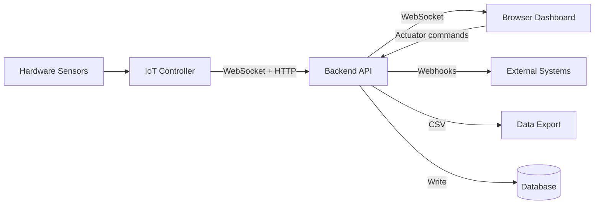

# User Guide

Welcome to the WebMACS User Guide. This section explains every feature of the platform — from live sensor monitoring to automated alerting and data export.

WebMACS (**Web-based Monitoring and Control System**) is designed for operators who need to monitor industrial sensors, control actuators, run timed experiments, and export data — all from a browser.

---

## What Can I Do with WebMACS?

| Feature | What It Does |
|---|---|
| :material-monitor-dashboard: [Dashboard](dashboard.md) | See all sensor values live, toggle actuators, adjust range controls, view a real-time chart |
| :material-format-list-bulleted: [Events & Sensors](events.md) | Define sensors, actuators, and range controls that the controller reads from hardware |
| :material-flask: [Experiments](experiments.md) | Group datapoints into time-bounded experiments for later analysis |
| :material-database: [Datapoints](datapoints.md) | Browse the raw data stream collected from every sensor |
| :material-alert: [Automation Rules](rules.md) | Trigger alerts or webhooks when sensor values exceed thresholds |
| :material-webhook: [Webhooks](webhooks.md) | Push notifications to external systems (Slack, Teams, custom APIs) |
| :material-file-delimited: [CSV Export](csv-export.md) | Download experiment data as a spreadsheet-ready CSV file |
| :material-update: [OTA Updates](ota.md) | Update the system firmware over the network |
| :material-text-box: [Logs](logs.md) | View system log entries (info, warnings, errors) |
| :material-account-group: [Users](users.md) | Manage operator and admin accounts |

---

## Quick Overview

---

## Recommended Reading Order

1. **[Dashboard](dashboard.md)** — understand the live view and controls
2. **[Events & Sensors](events.md)** — configure what you monitor
3. **[Experiments](experiments.md)** — group data into experiments
4. **[CSV Export](csv-export.md)** — get data out for analysis
5. **[Automation Rules](rules.md)** — set up threshold-based alerts
6. **[Webhooks](webhooks.md)** — notify external systems
7. **[OTA Updates](ota.md)** — manage firmware deployments

---

## User Roles

WebMACS has two user roles:

| Role | Can Access |
|---|---|
| **Operator** | Dashboard, Events, Experiments, Datapoints, CSV Export, Logs |
| **Admin** | Everything above **+** Rules, Webhooks, OTA Updates, User Management |

Admin-only pages are marked with a :material-shield-lock: icon in the sidebar.

---

## Need Help?

- **[Configuration Guide](../getting-started/configuration.md)** — environment variables and settings
- **[Architecture Overview](../architecture/overview.md)** — technical deep dive
- **[API Reference](../api/rest.md)** — REST endpoint documentation
- **[GitHub Issues](https://github.com/stefanposs/webmacs/issues)** — report bugs or request features
