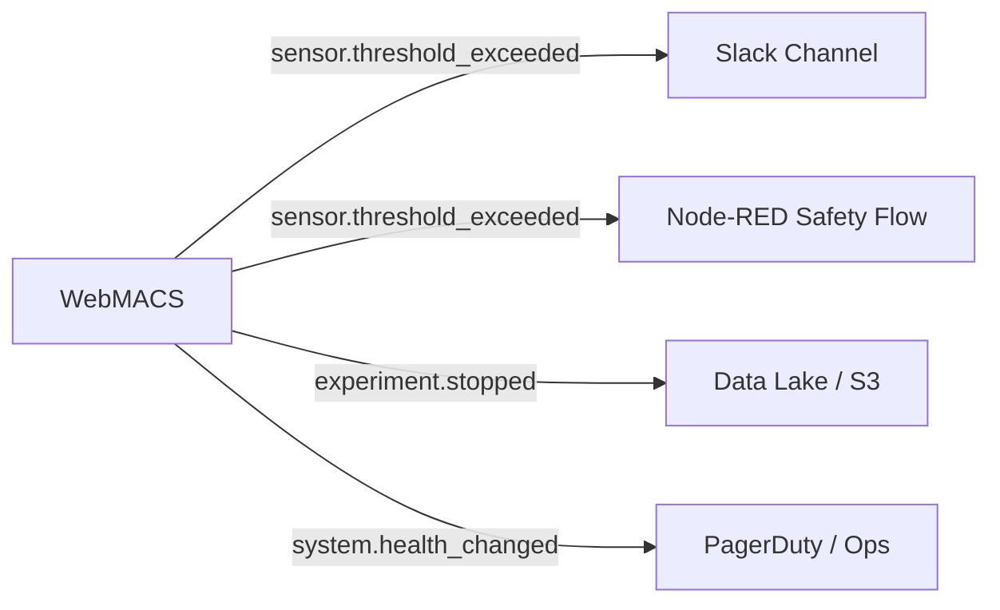
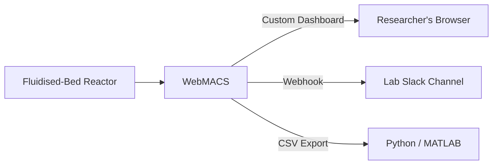
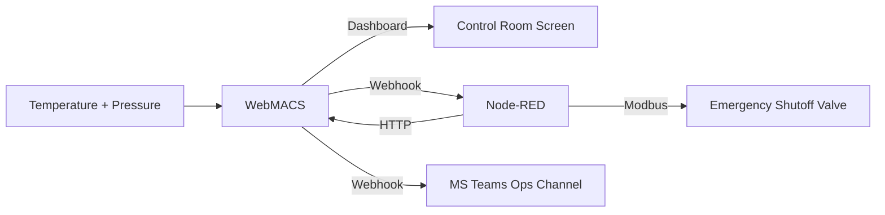
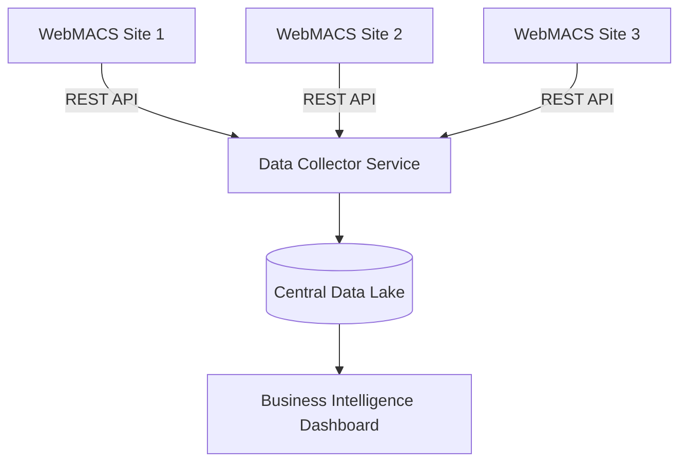

# Integrations & Extensibility

WebMACS is designed as a **building block** — not a closed box. Every feature is
accessible through open APIs, so you can connect WebMACS to the rest of your
toolchain with zero vendor involvement.

> Think of WebMACS as a **Swiss army knife** for lab and plant data: it does the
> job on its own, but it also plugs into anything you already use.

---

## Three Ways to Integrate

### 1. REST API — Build On Top

The REST API exposes **30+ endpoints** covering every resource in the system:
experiments, events, datapoints, rules, webhooks, dashboards, users, OTA, and
system health.

**Use cases:**

- Pull experiment data into a custom reporting dashboard
- Automate experiment start/stop from a CI/CD pipeline
- Sync sensor configurations across environments
- Build a mobile companion app

```bash
# Example: get the latest datapoint per sensor
curl http://webmacs.local/api/v1/datapoints/latest \
  -H "Authorization: Bearer $TOKEN"
```

[**Full REST Reference →**](../api/rest.md)

---

### 2. WebSocket — Stream in Real Time

The WebSocket API delivers sensor data with **sub-second latency**. Connect any
custom UI, data logger, or monitoring tool to a live data stream.

**Use cases:**

- Feed a wall-mounted Grafana dashboard with live sensor values
- Build a custom HMI touch-screen interface
- Log data to InfluxDB or TimescaleDB in real time
- Trigger alerts in external systems instantly

```javascript
// Connect to the live datapoint stream
const ws = new WebSocket(
  `ws://webmacs.local/ws/datapoints/stream?token=${jwt}`
);

ws.onmessage = (event) => {
  const msg = JSON.parse(event.data);
  if (msg.type === "datapoints_batch") {
    console.log("Live readings:", msg.datapoints);
  }
};
```

[**WebSocket API Reference →**](../api/websocket.md)

---

### 3. Webhooks — React to Events

Webhooks push **HMAC-signed HTTP POST** requests to any endpoint whenever
something happens. No polling required — WebMACS calls *you*.

**Use cases:**

- Send Slack alerts when a sensor exceeds a threshold
- Trigger a Node-RED flow to activate a safety interlock
- Notify Home Assistant to turn on ventilation
- Post experiment results to a central data lake



[**Webhook Guide →**](webhooks.md)

---

## Integration at a Glance

| Layer | Direction | Latency | Best For |
|-------|-----------|---------|----------|
| **REST API** | Pull (you request) | ~50 ms | CRUD operations, data pipelines, mobile apps |
| **WebSocket** | Stream (continuous) | ~10 ms | Live dashboards, custom UIs, real-time logging |
| **Webhooks** | Push (we notify you) | ~100 ms | Alerts, cross-system automation, event-driven workflows |

!!! tip "Mix and match"
    Most real-world setups combine all three layers. Use the REST API to set up
    experiments, WebSocket for live monitoring, and webhooks for alerts and
    automation triggers.

---

## Real-World Integration Architectures

### University Lab with Slack Alerts



- **Custom dashboard** for live monitoring during experiments
- **Slack webhook** fires when temperature crosses 200 °C
- **CSV export** after each experiment for thesis data analysis

---

### Pilot Plant with Node-RED Safety Layer



- **Custom dashboard** on a wall screen with gauges and live charts
- **Node-RED** receives `sensor.threshold_exceeded` → closes safety valve via Modbus
- **Teams webhook** notifies the operations team

---

### Multi-Site Monitoring with Central Data Lake



- Each site runs WebMACS independently (no cloud dependency)
- A central service polls each site's REST API for experiment data
- BI dashboard aggregates across all sites

---

## Webhook Event Types

| Event | Fires When |
|-------|-----------|
| `sensor.reading` | Every new datapoint (high volume — use carefully) |
| `sensor.threshold_exceeded` | An automation rule detects an out-of-range value |
| `experiment.started` | An experiment begins recording |
| `experiment.stopped` | An experiment ends |
| `system.health_changed` | System goes degraded or recovers |

Every webhook delivery is **HMAC-SHA256 signed** when a secret is configured,
so you can verify authenticity even over public networks.

---

## Integration Checklist

| Step | Action |
|------|--------|
| 1 | Get a JWT token via `POST /api/v1/auth/login` |
| 2 | Decide your pattern: **pull** (REST), **stream** (WebSocket), or **push** (webhook) |
| 3 | For webhooks: create a subscription with target URL, secret, and event types |
| 4 | For REST: use `Authorization: Bearer <token>` header |
| 5 | For WebSocket: append `?token=<jwt>` to the connection URL |
| 6 | Verify HMAC signatures on incoming webhooks (see [verification guide](webhooks.md#hmac-signature-verification)) |
| 7 | Test with `sensor.threshold_exceeded` before subscribing to `sensor.reading` |

---

## What Makes This Different?

Most industrial monitoring systems charge extra for API access or limit
integrations to approved partners. WebMACS is **fully open from day one**:

| Feature | WebMACS | Typical SCADA |
|---------|---------|---------------|
| REST API | Full CRUD, 30+ endpoints, free | Limited or paid add-on |
| WebSocket | Native, sub-second streaming | Proprietary protocol |
| Webhooks | 5 event types, HMAC-signed, retry logic | Not available |
| Data export | Streaming CSV, unlimited | Per-query limits or extra license |
| Custom integrations | Unlimited, no approval needed | Vendor-gated marketplace |

!!! success "The Bottom Line"
    WebMACS doesn't compete with your other tools — it **connects them**. Your
    existing alerting, automation, and analytics stack gets a new real-time data
    source with zero licensing friction. One Lego brick that fits everywhere.

---

## Next Steps

- [Custom Dashboards](dashboard.md) — build your own monitoring views
- [Webhooks](webhooks.md) — detailed webhook configuration and HMAC verification
- [REST API Reference](../api/rest.md) — all 30+ endpoints
- [WebSocket API](../api/websocket.md) — real-time streaming protocol
