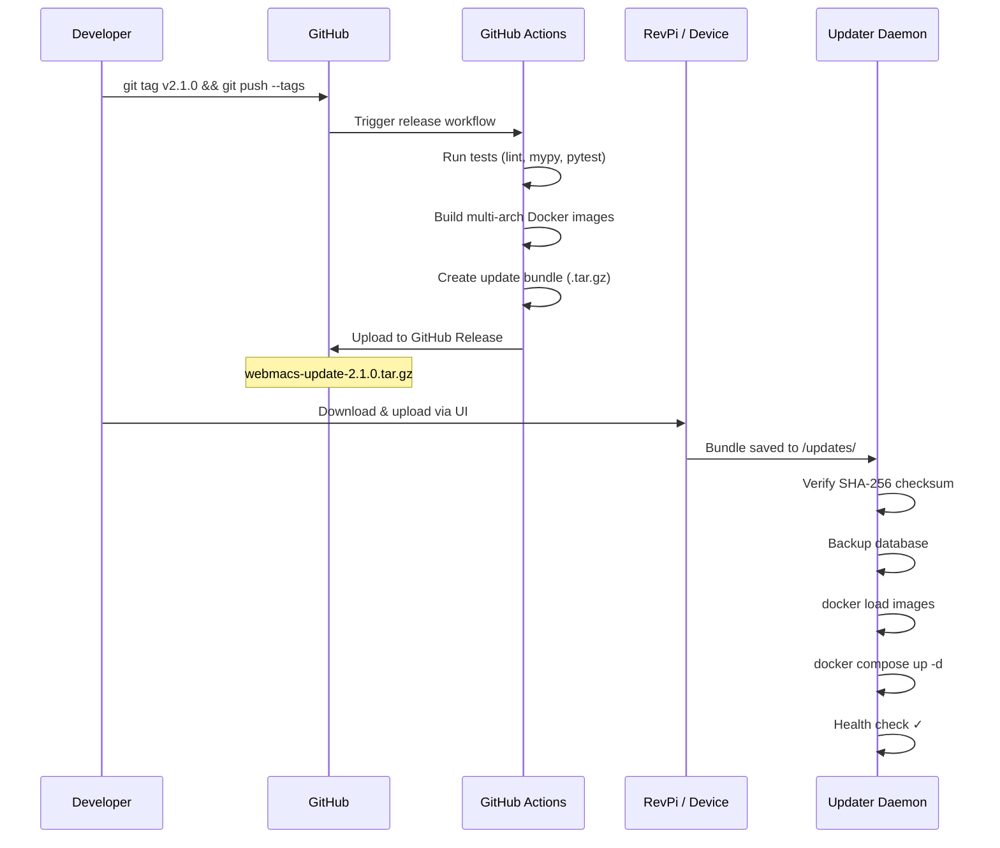

# OTA Updates

Complete guide to WebMACS Over-The-Air updates — from building a release to customer deployment.

!!! tip "Quick Start"
    The `scripts/` directory contains two ready-to-use scripts that handle everything:

    - **`scripts/build-update-bundle.sh <version>`** — builds a self-contained `.tar.gz` update bundle
    - **`scripts/install.sh <bundle.tar.gz>`** — installs WebMACS on a fresh device (Docker, credentials, systemd — all automated)

    See [Installation Guide](../deployment/installation-guide.md) for detailed first-time setup.

---

## How OTA Works



### What's in a Bundle?

| File | Purpose |
|---|---|
| `manifest.json` | Version, SHA-256 checksum, changelog, image list |
| `images.tar` | All Docker images (`backend`, `frontend`, `controller`) |
| `docker-compose.prod.yml` | Production compose file |
| `install.sh` | First-time installation script |

---

## For Developers: Releasing a New Version

### Option A — Via GitHub (Recommended)

Push a git tag and GitHub Actions builds the bundle automatically:

```bash
# 1. Make your code changes
git add .
git commit -m "feat: new sensor calibration"

# 2. Tag the release
git tag v2.1.0
git push origin main --tags
```

**What happens automatically:**

1. CI runs all tests (ruff, mypy, pytest, eslint, vitest)
2. Docker images are built for **AMD64 + ARM64** (cross-platform)
3. Images are packaged into `webmacs-update-2.1.0.tar.gz`
4. A [GitHub Release](https://github.com/stefanposs/webmacs/releases) is created with the bundle attached

Download the bundle from the Releases page and deliver it to the customer.

### Option B — Local Build with `scripts/build-update-bundle.sh`

Build manually on your machine (for testing or airgapped environments):

```bash
./scripts/build-update-bundle.sh 2.1.0
# Output: dist/webmacs-update-2.1.0.tar.gz
```

The script performs these steps:

| Step | Action |
|---|---|
| 1. Build | `docker compose build --no-cache` — builds all 3 images |
| 2. Tag | Tags images as `webmacs-backend:2.1.0`, etc. |
| 3. Export | `docker save` → `images.tar` |
| 4. Checksum | SHA-256 hash of `images.tar` |
| 5. Manifest | `manifest.json` with version, checksum, image list |
| 6. Package | Combines everything into `dist/webmacs-update-2.1.0.tar.gz` |

The bundle is fully self-contained and can be deployed to an airgapped device via USB stick.

!!! warning "Architecture"
    `just bundle` builds for your **host architecture only**.
    If you build on x86_64 and deploy to an ARM RevPi, it won't work.
    Use the GitHub Actions workflow for multi-arch builds.

---

## For Customers: Installation

### First-Time Install with `scripts/install.sh`

You receive a `.tar.gz` bundle from your system integrator or download it from GitHub Releases.

#### Step 1 — Transfer to Device

=== "Via SCP (network)"

    ```bash
    scp webmacs-update-2.0.0.tar.gz pi@<device-ip>:/tmp/
    ```

=== "Via USB stick"

    ```bash
    sudo mount /dev/sda1 /mnt
    cp /mnt/webmacs-update-2.0.0.tar.gz /tmp/
    sudo umount /mnt
    ```

#### Step 2 — Run Installer

```bash
ssh pi@<device-ip>

# Run the install script with the bundle
sudo bash scripts/install.sh /tmp/webmacs-update-2.0.0.tar.gz
```

!!! tip "One Command Does Everything"
    `scripts/install.sh` is a single, self-contained script. You don't need to install anything manually — it handles Docker, credentials, images, and systemd auto-start.

The installer handles everything:

| Step | Action |
|---|---|
| Docker | Installs Docker + Compose (if missing) |
| Directories | Creates `/opt/webmacs` with update folders |
| Credentials | Generates random `SECRET_KEY`, `DB_PASSWORD`, admin password |
| Images | Loads Docker images from the bundle |
| Services | Starts all 4 containers |
| Boot | Creates systemd service for auto-start |

!!! danger "Save Your Credentials"
    The admin password is shown **only once** during installation.
    It is also stored in `/opt/webmacs/.env`.

#### Step 3 — Open Browser

Navigate to `http://<device-ip>` and log in.

!!! tip "Finding the Device IP"
    Run `hostname -I` on the device.

---

### Applying Updates

Three options to update an existing installation:

=== "Web UI (Easiest)"

    1. Download the `.tar.gz` bundle
    2. Open WebMACS → **OTA Updates**
    3. Click **Upload Bundle** and select the file
    4. The system verifies, backs up, loads images, and restarts (~3-8 min)

=== "SCP / USB (Automatic)"

    Copy the bundle to the update directory:
    ```bash
    scp webmacs-update-2.1.0.tar.gz pi@<ip>:/opt/webmacs/updates/
    ```
    The updater daemon detects and applies it within 30 seconds.

=== "Command Line (Manual)"

    ```bash
    cd /opt/webmacs
    sudo tar -xzf /path/to/webmacs-update-2.1.0.tar.gz -C /tmp/update
    sudo docker load -i /tmp/update/images.tar
    sudo sed -i "s/^WEBMACS_VERSION=.*/WEBMACS_VERSION=2.1.0/" .env
    sudo docker compose -f docker-compose.prod.yml --env-file .env up -d
    ```

---

## Managing Updates in the UI

Navigate to **OTA Updates** in the sidebar.

### System Version & GitHub Check

The card at the top shows the running version and whether an update is available.
Click **Check for Updates** to query both the local database and **GitHub Releases**.

The **GitHub Releases** card below shows:

| State | What You See |
|---|---|
| Release exists, newer than installed | **"newer"** badge + **Download Bundle** button |
| Release exists, same as installed | **"installed"** badge + link to release page |
| No releases published yet | "No releases published yet" message |
| GitHub unreachable (offline device) | Warning with the error message |

!!! tip "Automatic version check"
    The OTA page checks for updates automatically when opened. On devices without internet access, the GitHub check times out gracefully and the local database is still checked.

!!! info "Container-only updates"
    The OTA update system works with **Docker containers only**. It uses `docker load` + `docker compose up` to apply updates. Native (non-Docker) installations are not supported by the self-updater.

### Uploading a Bundle

1. Click **Upload Bundle**
2. Select the `.tar.gz` file
3. A progress bar shows the upload status
4. Once uploaded, the updater daemon applies it automatically

### Creating an Update Record

Click **New Update** to manually register a version:

| Field | Required | Description |
|---|---|---|
| Version | Yes | Semantic version (e.g. `2.1.0`) |
| Release Notes | No | Description of changes |

### Update Statuses

| Status | Description |
|---|---|
| `pending` | Registered, not yet applied |
| `downloading` | Firmware being downloaded |
| `verifying` | Integrity check in progress |
| `applying` | Images being loaded, services restarting |
| `completed` | Successfully applied |
| `failed` | Update failed — check logs |
| `rolled_back` | Reverted to previous version |

### Rolling Back

Click **Rollback** on a `completed` update to revert:

```
completed → rolled_back
```

---

## Why Not Balena?

| | WebMACS OTA | Balena |
|---|---|---|
| **Cost** | Free (GitHub Actions) | Paid (after 10 devices) |
| **Offline** | ✅ Full offline support | ❌ Requires cloud |
| **Dependencies** | Docker only | Balena OS + account |
| **Control** | Full — your code, your infra | Vendor lock-in |
| **Ideal for** | Single devices, small fleets | Large fleets (100+) |

WebMACS OTA is designed for **single-device or small-fleet** deployments.
If you later manage 50+ devices, you can add Balena on top — the application code doesn't change.

---

## Safety & Recovery

### Integrity Verification

Every bundle includes a SHA-256 checksum in `manifest.json`. The updater verifies this **before** loading images.

### Automatic Database Backup

Before every update, `pg_dump` saves a timestamped backup to `/opt/webmacs/updates/backups/`.

### Health Check

After restarting, the updater checks `GET /health` (10 retries × 5s). Failures are marked and logged.

### Failed Update Recovery

On failure:

1. Compose file restored from `.bak`
2. Bundle moved to `updates/failed/` (no retry loop)
3. Previous version keeps running

Manual recovery:

```bash
cd /opt/webmacs

# Restore database backup
cat updates/backups/webmacs_backup_*.sql | \
  docker compose -f docker-compose.prod.yml exec -T db psql -U webmacs webmacs

# Restart
sudo systemctl restart webmacs
```

---

## File Structure

```
/opt/webmacs/
├── .env                          # Credentials & version (auto-managed)
├── docker-compose.prod.yml       # Production compose file
└── updates/
    ├── webmacs-update-2.1.0.tar.gz   # ← drop bundles here
    ├── applied/                       # Successfully applied
    ├── backups/                       # Database backups (pre-update)
    └── failed/                        # Failed bundles (won't retry)
```

---

## FAQ

**How long does an update take?**
: On a RevPi (~ARM Cortex-A53): 3–8 minutes. Most time is `docker load`.

**Can I update without internet?**
: Yes. Copy the `.tar.gz` via USB or local network. Everything is self-contained.

**What if power is lost during an update?**
: After reboot, systemd restarts the previous containers. The failed bundle moves to `updates/failed/`.

**Can I skip versions?**
: Yes. Bundles are self-contained. Go from v2.0.0 to v2.5.0 directly.

**How do I check the current version?**
: Web UI → OTA Updates, or `cat /opt/webmacs/.env | grep WEBMACS_VERSION`, or `curl http://localhost/api/v1/ota/check`.

---

## Next Steps

- [Installation Guide](../deployment/installation-guide.md) — detailed first-time setup
- [Docker Deployment](../deployment/docker.md) — container architecture
- [API Reference](../api/rest.md) — programmatic OTA endpoints
