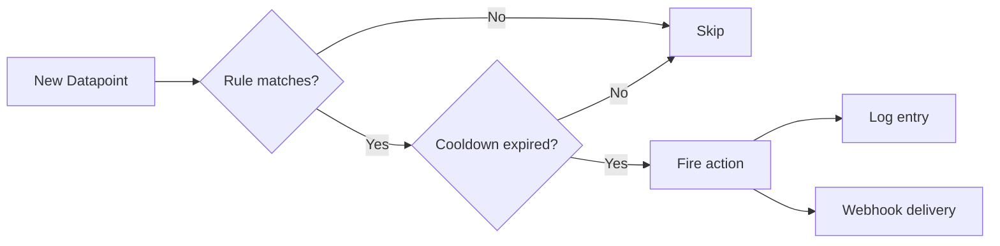

# Automation Rules

Rules let you define threshold-based automations: when a sensor value meets a condition, WebMACS can log an alert or trigger a [webhook](webhooks.md) delivery — without any code on your part.

!!! info "Admin only"
    Rule management requires an **admin** account.

---

## How Rules Work



Every time a datapoint is created, WebMACS evaluates **all enabled rules** that target the same event:

1. **Condition check** — compare the datapoint value against the rule's operator and threshold
2. **Cooldown check** — skip if the rule fired recently (within `cooldown_seconds`)
3. **Action** — log the alert and/or trigger a webhook delivery

---

## Creating a Rule

### Via the UI

1. Navigate to **Rules** in the sidebar (admin only)
2. Click **New Rule**
3. Configure:

| Field | Required | Description |
|---|---|---|
| **Name** | Yes | Descriptive label (e.g. "High Temp Alert — Reactor A") |
| **Event** | Yes | Which sensor event to monitor (dropdown) |
| **Operator** | Yes | Comparison operator (see table below) |
| **Threshold** | Yes | The value to compare against |
| **Threshold High** | Only for `between` / `not between` | Upper bound of the range |
| **Action Type** | Yes | `log` or `webhook` |
| **Webhook Event Type** | Only for `webhook` actions | Which webhook event type to dispatch |
| **Cooldown (seconds)** | Yes | Minimum seconds between consecutive triggers |
| **Active** | Yes | Enable or disable the rule |

4. Click **Create**

### Via the API

```bash
curl -X POST http://localhost:8000/api/v1/rules \
  -H "Authorization: Bearer $TOKEN" \
  -H "Content-Type: application/json" \
  -d '{
    "name": "High Temp Alert",
    "event_public_id": "evt_temp_inlet",
    "operator": "gt",
    "threshold": 200,
    "action_type": "webhook",
    "webhook_event_type": "sensor.threshold_exceeded",
    "cooldown_seconds": 300,
    "enabled": true
  }'
```

---

## Operators

| Operator | Symbol | Condition | Example |
|---|---|---|---|
| `gt` | > | Value is greater than threshold | Temperature > 200 |
| `lt` | < | Value is less than threshold | Pressure < 0.5 |
| `gte` | ≥ | Greater than or equal | Flow ≥ 10 |
| `lte` | ≤ | Less than or equal | Level ≤ 5 |
| `eq` | = | Equal (ε = 1e-9) | Status = 1 |
| `between` | min ≤ x ≤ max | Value is within range | 20 ≤ Temp ≤ 80 |
| `not_between` | x < min or x > max | Value is outside range | Temp < 20 or > 80 |

!!! tip "Between vs Not Between"
    Use **`between`** to trigger when values are **within** a normal range — useful for confirming steady-state.  
    Use **`not_between`** to trigger when values go **outside** the safe range — this is the most common alerting pattern.

---

## Action Types

### :material-text-box: Log

Creates a structured log entry when the condition is met. Visible on the [Logs](logs.md) page. Useful for audit trails and post-experiment review.

### :material-webhook: Webhook

Dispatches a `sensor.threshold_exceeded` (or other) webhook event to all matching [webhook subscriptions](webhooks.md). Use this to send alerts to Slack, Teams, or custom APIs.

!!! example "Combined setup"
    Create two rules for the same event:

    1. `Inlet Temp > 200 → log` (always log for audit)
    2. `Inlet Temp > 250 → webhook` (alert team only when critical)

---

## Cooldown Period

The cooldown prevents rules from firing repeatedly when a sensor value stays above a threshold.

| Cooldown | Behaviour |
|---|---|
| 60 s (default) | At most one trigger per minute |
| 300 s | At most once every 5 minutes |
| 0 s | Fire on every matching datapoint (use with caution) |

!!! warning "Alert fatigue"
    Setting cooldown to 0 with a `webhook` action can generate hundreds of deliveries per minute. Use a reasonable cooldown (60–300 s) for alerting.

```mermaid
gantt
    title Cooldown example (300 s)
    dateFormat X
    axisFormat %s
    section Rule fires
    Trigger 1           :done, 0, 1
    Cooldown (skip)     :active, 1, 300
    Trigger 2           :done, 300, 301
    Cooldown (skip)     :active, 301, 600
```



---

## Rule Table Columns

| Column | Description |
|---|---|
| **Name** | Rule label |
| **Event** | Monitored sensor name |
| **Operator** | Comparison symbol ( >, <, ≥, ≤, =, between, not between) |
| **Threshold** | Threshold value (or range for between/not_between) |
| **Action** | `webhook` or `log` badge |
| **Active** | Enabled/disabled |
| **Cooldown** | Seconds between triggers |
| **Last Triggered** | Timestamp of last activation |
| **Created** | Creation date |

---

## Example Scenarios

=== "Temperature alert"

    **Event**: Inlet Temperature  
    **Operator**: `gt` (>)  
    **Threshold**: 200  
    **Action**: `webhook` → `sensor.threshold_exceeded`  
    **Cooldown**: 300 s

    Sends a Slack notification when inlet temperature exceeds 200°C, at most once every 5 minutes.

=== "Pressure out of range"

    **Event**: Chamber Pressure  
    **Operator**: `not_between`  
    **Threshold**: 0.8 / **Threshold High**: 1.2  
    **Action**: `webhook` → `sensor.threshold_exceeded`  
    **Cooldown**: 60 s

    Alerts when pressure goes below 0.8 bar or above 1.2 bar.

=== "Audit logging"

    **Event**: Valve Status  
    **Operator**: `eq` (=)  
    **Threshold**: 1  
    **Action**: `log`  
    **Cooldown**: 0 s

    Logs every time the valve opens (value = 1). Good for compliance trails.

---

## Best Practices

!!! tip "Recommendations"
    - **Name rules descriptively** — include the sensor name and threshold in the rule name
    - **Set reasonable cooldowns** — 60-300 s for webhook alerts, 0 s only for log-only actions
    - **Combine `log` and `webhook` rules** — log everything, webhook only critical thresholds
    - **Use `not_between`** for safe-range monitoring — it triggers when values leave the normal window
    - **Review the Last Triggered column** — rules that never fire may have incorrect thresholds

---

## Next Steps

- [Webhooks](webhooks.md) — configure where webhook alerts are delivered
- [Events & Sensors](events.md) — set up the sensors that rules monitor
- [Logs](logs.md) — view rule-triggered log entries
