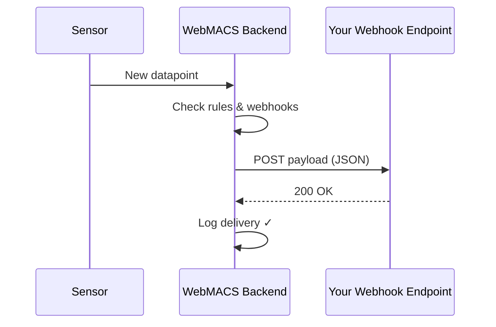

# Webhooks

## Push Events to Any System — Automatically

Webhooks turn WebMACS into an **active participant** in your infrastructure.
Instead of polling for changes, external systems receive instant notifications
the moment something happens — a sensor spikes, an experiment ends, or the
system health degrades.

Combined with the [REST API](../api/rest.md) and [WebSocket streaming](../api/websocket.md),
webhooks complete the integration trifecta: **pull, stream, and push**. See
[Integrations & Extensibility](integrations.md) for the full picture.

!!! info "Admin only"
    Webhook management requires an **admin** account.

---

## How It Works



1. A trigger occurs (new sensor reading, threshold exceeded, experiment started/stopped, …)
2. WebMACS finds all **enabled** webhook subscriptions matching that event type
3. A JSON payload is sent via HTTP POST to each matching URL
4. The delivery result is logged (success, failure, status code)

---

## Webhook Event Types

| Event Type | When It Fires |
|---|---|
| `sensor.reading` | Every time a new sensor datapoint is recorded |
| `sensor.threshold_exceeded` | An [automation rule](rules.md) triggers a threshold violation |
| `experiment.started` | An experiment is created and begins running |
| `experiment.stopped` | An experiment is stopped |
| `system.health_changed` | System health status changes (degraded / recovered) |

!!! tip "Choose wisely"
    `sensor.reading` webhooks are **throttled**: at most one delivery per sensor channel every 5 seconds.
    With 8 channels, this means ~96 deliveries per minute maximum.
    For alerting, `sensor.threshold_exceeded` is usually more appropriate — it fires only when a [rule](rules.md) triggers.

---

## Creating a Webhook

### Via the UI

1. Navigate to **Webhooks** in the sidebar (admin only)
2. Click **New Webhook**
3. Fill in the fields:

| Field | Required | Description |
|---|---|---|
| **URL** | Yes | The endpoint to receive POST requests (use HTTPS in production) |
| **Secret** | No | Shared secret for HMAC-SHA256 signature verification |
| **Event Types** | Yes | Select one or more event types to subscribe to |
| **Active** | Yes | Toggle to enable or disable deliveries |

4. Click **Create**

### Via the API

```bash
curl -X POST http://localhost:8000/api/v1/webhooks \
  -H "Authorization: Bearer $TOKEN" \
  -H "Content-Type: application/json" \
  -d '{
    "url": "https://hooks.example.com/services/T.../B.../xxx",
    "secret": "my-shared-secret",
    "events": ["sensor.threshold_exceeded", "experiment.stopped"],
    "enabled": true
  }'
```

!!! warning "Duplicate URLs"
    Each URL can only be registered once. Attempting to create a duplicate returns **409 Conflict**.

---

## Payload Format

Every delivery sends a JSON body:

```json
{
  "type": "sensor.threshold_exceeded",
  "time": "2025-01-15T10:30:00Z",
  "sensor": "Inlet Temperature",
  "value": 215.3,
  "device": "webmacs-prod-01"
}
```

The `data` fields vary by event type. Experiment events include `experiment_name` and `experiment_id`.

---

## HMAC Signature Verification

If you set a **secret**, every delivery includes two headers for security:

| Header | Value |
|---|---|
| `X-Webhook-Signature` | `<hex-digest>` (bare HMAC-SHA256 hex) |
| `X-Webhook-Timestamp` | Unix timestamp of the delivery |

The HMAC is computed over `{timestamp}.{payload_body}` using SHA-256.

### Verification Example (Python)

```python
import hmac, hashlib

def verify(secret: str, timestamp: str, body: bytes, signature: str) -> bool:
    message = f"{timestamp}.".encode() + body
    expected = hmac.new(secret.encode(), message, hashlib.sha256).hexdigest()
    return hmac.compare_digest(expected, signature)
```

!!! tip "Replay protection"
    Reject deliveries where `X-Webhook-Timestamp` is more than 5 minutes old.

---

## Delivery Log

Each webhook has a delivery log accessible via the API. Every delivery attempt is recorded with:

| Field | Description |
|---|---|
| **Status** | `pending` → `delivered` → or `failed` → `dead_letter` |
| **HTTP Status** | Response code from your endpoint (200, 500, timeout, …) |
| **Attempts** | Number of delivery attempts (max 3) |
| **Error** | Error message if failed |
| **Timestamp** | When the delivery was attempted / completed |

### Retry Behaviour

| Attempt | Delay | Total Wait |
|---|---|---|
| 1st attempt | Immediate | — |
| 2nd attempt | 2 seconds | 2 s |
| 3rd attempt | 4 seconds | 6 s |

After 3 total attempts, the delivery is marked as **dead_letter** and will not be retried.

!!! note "Delivery log"
    Delivery history is available via the API (`GET /webhooks/{id}/deliveries`). A UI delivery log viewer is planned for a future release.

### Viewing Deliveries via API

```bash
curl http://localhost:8000/api/v1/webhooks/$WEBHOOK_ID/deliveries \
  -H "Authorization: Bearer $TOKEN"
```

Filter by status: `?status=failed`

---

## Integration Examples

=== "Slack"

    Use a [Slack Incoming Webhook](https://api.slack.com/messaging/webhooks) URL:

    ```
    https://hooks.example.com/services/T00000000/B00000000/XXXXXXXXXXXXXXXXXXXXXXXX
    ```

    Slack expects a `text` field, so you may need a proxy/transform layer.

=== "Microsoft Teams"

    Use a Teams [Incoming Webhook connector](https://learn.microsoft.com/en-us/microsoftteams/platform/webhooks-and-connectors/how-to/add-incoming-webhook) URL.

=== "Custom API"

    Point the webhook at any HTTPS endpoint that accepts POST with JSON body and returns 2xx.

---

## Rate Limiting & Safeguards

WebMACS includes built-in protection to prevent webhook dispatching from
overwhelming your endpoints or the backend itself:

| Safeguard | Detail |
|---|---|
| **Sensor throttle** | `sensor.reading` events are dispatched at most once per sensor channel every **5 seconds** — high-frequency ingestion does not create a flood of deliveries |
| **Concurrency limit** | At most **10** outgoing webhook HTTP requests run simultaneously; additional deliveries queue until a slot is free |
| **Retry cap** | Failed deliveries are retried at most **3 times** with exponential backoff (2 s, 4 s) — then permanently marked `dead_letter` |
| **Delivery timeout** | Each outgoing HTTP request times out after **10 seconds** to prevent slow endpoints from blocking the dispatch queue |

These safeguards ensure that even if a receiving endpoint goes down or returns
errors, the WebMACS backend remains responsive for all users.

---

## Best Practices

!!! tip "Recommendations"
    - **Always use HTTPS** in production environments
    - **Set a webhook secret** and verify HMAC signatures to prevent spoofing
    - **Monitor the delivery log** — failed deliveries indicate connectivity or endpoint issues
    - **Disable unused webhooks** to reduce unnecessary network traffic
    - **Use `sensor.threshold_exceeded`** instead of `sensor.reading` for alerting — it fires only when rules trigger, not on every reading
    - **Set appropriate timeouts** on your receiving endpoint — WebMACS waits up to 10 seconds per delivery
    - **Avoid free webhook testers** (e.g. webhook.site) for sustained traffic — they rate-limit aggressively

---

## Next Steps

- [Automation Rules](rules.md) — define thresholds that trigger `sensor.threshold_exceeded` webhooks
- [Events & Sensors](events.md) — configure what is monitored
- [API Reference](../api/rest.md) — full webhook endpoint documentation
