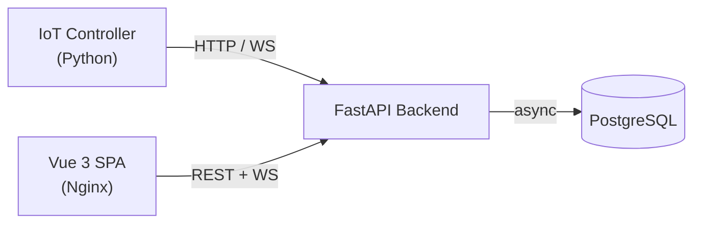

# WebMACS

**Web-based Monitoring and Control System** for IoT experiments.

WebMACS provides real-time sensor monitoring, experiment management, and telemetry for industrial IoT setups — specifically designed for **Wirbelschicht** (fluidised-bed) experiments at the TU Kaiserslautern Chair of Mechanical Process Engineering.

---

## Features

{ .screenshot }

<div class="grid-container" markdown>

<div class="grid-item" markdown>
### :material-monitor-dashboard: Real-Time Dashboard
Live sensor readings with auto-updating charts, WebSocket-first with HTTP polling fallback.
</div>

<div class="grid-item" markdown>
### :material-flask-outline: Experiment Management
Create, start, and stop experiments. All datapoints are automatically linked to the active experiment.
</div>

<div class="grid-item" markdown>
### :material-lan-connect: WebSocket Telemetry
Dual-mode controller telemetry (HTTP / WebSocket). Frontend streams via `/ws/datapoints/stream`.
</div>

<div class="grid-item" markdown>
### :material-file-delimited-outline: CSV Export
One-click download of all experiment datapoints as a CSV file — streamed via `StreamingResponse`.
</div>

<div class="grid-item" markdown>
### :material-database-cog-outline: Pluggable Storage
Protocol-based repository layer. Switch between **PostgreSQL** and **TimescaleDB** via a single env var.
</div>

<div class="grid-item" markdown>
### :material-docker: Docker Compose
Four-container stack (PostgreSQL, FastAPI, Vue/Nginx, Controller) — one command to start.
</div>

</div>

---

## Quick Start

```bash
# Clone the repository
git clone https://github.com/stefanposs/webmacs.git
cd webmacs

# Copy environment defaults
cp .env.example .env

# Spin up all services
docker compose up --build -d
```

Open **http://localhost** and log in with the seeded admin account (`admin@webmacs.io` / `admin123`).

---

## Architecture at a Glance



| Layer | Tech Stack |
|---|---|
| **Backend** | FastAPI · SQLAlchemy 2 async · Pydantic v2 · Python 3.14 |
| **Frontend** | Vue 3 · TypeScript · Vite · PrimeVue · Pinia |
| **Controller** | Python 3.14 · HTTPX · Async WebSocket |
| **Database** | PostgreSQL 17 (TimescaleDB optional) |
| **Infrastructure** | Docker Compose · Nginx reverse-proxy |

[**Learn more → Architecture Overview**](architecture/overview.md)

---

## Documentation

| Section | Audience | Description |
|---|---|---|
| [Getting Started](getting-started/installation.md) | Everyone | Install, configure, run |
| [User Guide](guide/index.md) | Operators | Dashboard, experiments, CSV export |
| [Architecture](architecture/overview.md) | Developers | System design, WebSocket, DB protocols |
| [API Reference](api/rest.md) | Developers | REST + WebSocket endpoint docs |
| [Development](development/contributing.md) | Contributors | Code style, testing, CI/CD |
| [Deployment](deployment/docker.md) | DevOps | Docker, production, env vars |

---

## Contributing

Contributions are welcome! See the [Contributing Guide](development/contributing.md) for development setup and workflow.

---

## License

MIT — see [LICENSE](https://github.com/stefanposs/webmacs/blob/main/LICENSE) for details.
