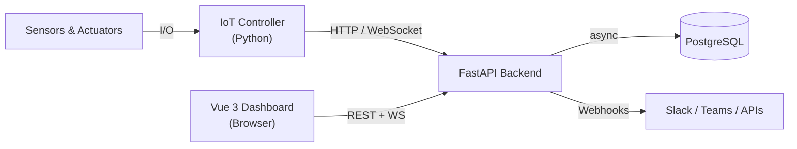

---
hide:
  - navigation
  - toc
---

# WebMACS

## Monitor. Automate. Control. — From Any Browser.

WebMACS is an **open-source control system** that turns your Raspberry Pi or Revolution Pi into a real-time monitoring and automation hub for lab experiments and industrial processes.

**No cloud. No subscriptions. No vendor lock-in.** Your data stays on your hardware.

{ .screenshot }

---

## Who Is WebMACS For?

<div class="grid-container" markdown>

<div class="grid-item" markdown>
### :material-flask-outline: Process Engineers & Researchers
Monitor fluidised-bed reactors, temperature profiles, pressure readings, and flow rates — all from your browser. Export experiment data to CSV for analysis in Excel, Python, or MATLAB.
</div>

<div class="grid-item" markdown>
### :material-cog-outline: Lab Technicians & Operators
Toggle valves, adjust setpoints, and track sensor trends on a live dashboard. Get alerted via Slack or email when values go out of range.
</div>

<div class="grid-item" markdown>
### :material-code-braces: Developers & Integrators
Extend the system with a clean REST + WebSocket API. Add new sensor types, build custom dashboards, or integrate with external systems via webhooks.
</div>

</div>

---

## What Can You Do With WebMACS?

| Capability | What It Means For You |
|---|---|
| :material-monitor-dashboard: **Real-Time Dashboard** | See every sensor value live, toggle actuators, build custom widget layouts — updated via WebSocket in under 100 ms |
| :material-flask: **Experiment Management** | Group all readings into named experiments. Start, stop, and export with one click |
| :material-chart-line: **Custom Dashboards** | Build your own dashboards with line charts, gauges, stat cards, and actuator toggles on a 12-column grid |
| :material-alert: **Threshold Alerts** | Define rules like "if temperature > 200 °C → notify Slack". No code required |
| :material-webhook: **Webhook Integrations** | Push events to Slack, Teams, Node-RED, Home Assistant, or any HTTP endpoint |
| :material-file-delimited: **CSV Export** | Download millions of datapoints as a CSV — streamed, instant, ready for pandas or Excel |
| :material-update: **Over-The-Air Updates** | Deploy new versions via USB, file upload, or network — works fully offline |
| :material-puzzle-outline: **Plugin System** | Connect any sensor or protocol — write a Python plugin, upload the `.whl` file, and see live data on your dashboard in under 20 minutes. No vendor, no recompilation. |
| :material-docker: **One-Command Install** | Single script installs Docker, generates credentials, starts all services, and enables auto-boot |

---

## Your Process. Your Dashboard.

Traditional SCADA systems lock you into predefined screens. WebMACS lets every
operator **build their own dashboard** — no programming required.

Pick from line charts, gauges, stat cards, and actuator toggles. Place them on a
12-column grid with size presets from compact to full-width. Each widget
connects to a live sensor event and refreshes automatically — with proper
axis labels, units, and time scales out of the box. Create as many dashboards
as you need: one for the reactor, one for the chiller loop, one for the client
demo.

**10 minutes, not 10 days.**

[**Build Your First Dashboard →**](guide/dashboard.md#custom-dashboards){ .md-button }

---

## Your Sensors. Your Protocol. Your Plugin.

Need to read a Modbus sensor? A serial weather station? An MQTT topic? With
WebMACS, you don't wait for a vendor update — you **write a Python class and
upload it as a `.whl` file**.

The plugin SDK gives you:

- **Five methods to implement** — `get_channels`, `_do_connect`,
  `_do_disconnect`, `_do_read`, `_do_write`
- **Built-in demo mode** — simulate realistic data without hardware
- **13 free conformance tests** — inherit from `PluginConformanceSuite`
- **Automatic channel → event mapping** — link a channel to an event and it
  flows into dashboards, alerts, CSV export, everything
- **A complete example** — `examples/custom-plugin/` contains a ready-to-build
  Weather Station plugin with tests and documentation

**20 minutes from idea to live data on your dashboard.**

[**Plugin Development Guide →**](development/plugin-development.md){ .md-button }

---

## Connect WebMACS to Everything

WebMACS isn't a closed box — it's a **Lego building block** that fits into your
existing infrastructure.

- **30+ REST endpoints** — read and write every resource programmatically
- **Plugin SDK** — build custom device drivers in Python and upload them as `.whl` packages — Modbus, MQTT, serial, or any protocol
- **WebSocket streaming** — sub-second live data for custom UIs
- **HMAC-signed webhooks** — push events to Slack, Node-RED, Home Assistant,
  or any HTTP endpoint
- **CSV export** — pipe data into pandas, Excel, or MATLAB

Think of it as a **Swiss army knife** for lab and plant data: one tool,
unlimited integrations.

[**See Integration Examples →**](guide/integrations.md){ .md-button }

---

## Get Started in 5 Minutes

=== "Production (RevPi / Raspberry Pi)"

    ```bash
    # Transfer the bundle to your device and run:
    sudo bash scripts/install.sh webmacs-update-2.0.0.tar.gz
    ```

    Open `http://<device-ip>` and log in with the credentials shown during install.
    See the [Installation Guide](deployment/installation-guide.md) for step-by-step details.

=== "Development (Local)"

    ```bash
    git clone https://github.com/stefanposs/webmacs.git
    cd webmacs
    docker compose up --build -d
    ```

    Open `http://localhost` and log in. See [Quick Start](getting-started/quick-start.md) for default credentials.

[**Quick Start Guide →**](getting-started/quick-start.md){ .md-button .md-button--primary }
[**View on GitHub →**](https://github.com/stefanposs/webmacs){ .md-button }

---

## Architecture at a Glance



| Layer | Technology |
|---|---|
| **Backend** | FastAPI · SQLAlchemy 2 async · Pydantic v2 · Python 3.13 |
| **Frontend** | Vue 3 · TypeScript · Vite · PrimeVue · Pinia |
| **Controller** | Python 3.13 · HTTPX · RevPi I/O |
| **Database** | PostgreSQL 17 |
| **Deployment** | Docker Compose · Nginx · systemd |

[**Architecture Deep Dive →**](architecture/overview.md)

---

## Documentation Map

| Section | For | What You'll Find |
|---|---|---|
| [Getting Started](getting-started/quick-start.md) | Everyone | Install, configure, first login |
| [User Guide](guide/index.md) | Operators & Engineers | Dashboard, experiments, rules, plugins, CSV export, OTA |
| [Architecture](architecture/overview.md) | Developers | System design, WebSocket protocol, database layer |
| [API Reference](api/rest.md) | Developers | REST + WebSocket endpoint docs, Pydantic schemas |
| [Development](development/contributing.md) | Contributors | Code style, testing, CI/CD, how to contribute |
| [Deployment](deployment/docker.md) | DevOps | Docker, production hardening, environment variables |

---

## Built With

<div class="grid-container" markdown>
<div class="grid-item" markdown>
:material-language-python: **Python 3.13** — Backend & Controller
</div>
<div class="grid-item" markdown>
:material-vuejs: **Vue 3** — Reactive SPA with TypeScript
</div>
<div class="grid-item" markdown>
:material-database: **PostgreSQL 17** — Reliable, proven storage
</div>
<div class="grid-item" markdown>
:material-docker: **Docker Compose** — One command, all services
</div>
</div>

---

## Contributing

Contributions are welcome! See the [Contributing Guide](development/contributing.md) for development setup and workflow.

---

## License

MIT — see [LICENSE](https://github.com/stefanposs/webmacs/blob/main/LICENSE) for details.