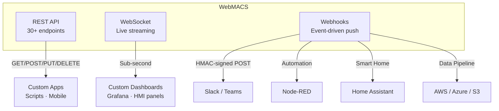

# Why WebMACS?

## The Problem

Traditional lab monitoring setups rely on:

- **Proprietary SCADA software** — expensive licenses, vendor lock-in, Windows-only
- **LabVIEW** — powerful but complex, requires specialized skills, expensive per-seat licensing
- **Spreadsheets + manual logging** — error-prone, no real-time visibility, no alerts
- **Custom scripts** — no UI, no experiment management, breaks when the author leaves

None of these give you a **browser-based, real-time dashboard with alerts and CSV export** that runs on a €200 Raspberry Pi.

---

## What Makes WebMACS Different

| Capability | WebMACS | Proprietary SCADA | LabVIEW | Manual Logging |
|---|---|---|---|---|
| **Cost** | Free (open-source, MIT) | €5,000–50,000+ | €3,000+ per seat | Free |
| **Real-time dashboard** | :material-check: Browser-based | :material-check: Desktop app | :material-check: Desktop | :material-close: |
| **Custom dashboards** | :material-check: Widget grid builder | :material-check: Proprietary | :material-check: Custom | :material-close: |
| **Threshold alerts** | :material-check: Slack, Teams, webhooks | :material-check: Proprietary | :material-check: Custom code | :material-close: |
| **CSV export** | :material-check: One-click, streaming | :material-check: | :material-check: | Manual |
| **Runs on Raspberry Pi** | :material-check: | :material-close: | :material-close: | N/A |
| **No cloud required** | :material-check: Fully offline | Varies | :material-check: | :material-check: |
| **Open REST + WebSocket API** | :material-check: | Varies | :material-check: | :material-close: |
| **Setup time** | ~5 minutes | Days / weeks | Hours / days | N/A |
| **Vendor lock-in** | None | High | Medium | None |
| **Multi-user access** | :material-check: Admin + operator roles | Varies | :material-close: | :material-close: |

---

## Deep Dive: Custom Dashboards — No Code, Full Control

With proprietary SCADA, changing a dashboard layout means calling the vendor or
writing custom scripts. With LabVIEW, it means editing a VI and recompiling.

With WebMACS, any operator can:

1. Click **"New Dashboard"** and name it (e.g., "Reactor Zone A")
2. **Add widgets** with a type picker and size presets (Small → Full Width)
3. Choose from **4 widget types**:
   - :material-chart-line: **Line Chart** — real-time trend for any sensor
   - :material-gauge: **Gauge** — at-a-glance value with colour-coded range
   - :material-card-text: **Stat Card** — big number with label and unit
   - :material-toggle-switch: **Actuator Toggle** — ON/OFF control for valves, relays, motors
4. Link each widget to a **live sensor event** — data refreshes automatically
5. Create **as many dashboards as needed** — one per zone, process, or team
6. Share a dashboard with all users by marking it as **global**

No recompilation. No vendor call. No license upgrade.

[**Dashboard Guide →**](guide/dashboard.md#custom-dashboards){ .md-button }

---

## Deep Dive: Open Integration — The Swiss Army Knife

Most monitoring systems are walled gardens. WebMACS is designed as a
**composable building block** that connects to anything.

### Three Integration Layers

| Layer | Best For | Example |
|-------|---------|---------|
| **REST API** | CRUD, scripted pipelines, mobile apps | `GET /experiments/{id}/export/csv` → feed a reporting tool |
| **WebSocket** | Live dashboards, low-latency custom UIs | Stream values to Grafana or a wall-mounted HMI panel |
| **Webhooks** | Alerts, cross-system automation | `sensor.threshold_exceeded` → Slack alert + Node-RED safety shutdown |

!!! success "The Bottom Line"
    WebMACS doesn't replace your other tools — it **powers them**. Use the REST
    API to build, WebSocket to stream, and webhooks to react. Your lab's
    monitoring system becomes the data backbone of your entire workflow.

[**Integration Guide →**](guide/integrations.md){ .md-button }

---

## Ideal Use Cases

### :material-school: University Research Labs
Monitor fluidised-bed reactors, autoclaves, fermenters — with full experiment tracking and CSV export for thesis data.

### :material-factory: Pilot Plants
Track temperature, pressure, and flow across multiple zones. Set threshold alerts to catch anomalies early.

### :material-clipboard-check: Quality Assurance
Log every sensor reading with timestamps for compliance audits. Export complete data trails on demand.

### :material-account-group: Teaching Labs
Students interact via browser — no software installation needed. Each team gets their own dashboard view.

---

## What You Get Out of the Box

1. **Live dashboard** — sensor cards, actuator toggles, trend charts with configurable time ranges
2. **Custom dashboards** — build your own layouts with line charts, gauges, stat cards, and actuator controls
3. **Experiment tracking** — named runs with automatic data linking and one-click CSV export
4. **Alerting** — threshold rules with Slack/Teams/webhook notifications and cooldown periods
5. **Data export** — streaming CSV downloads for Excel, Python, or MATLAB analysis
6. **User management** — admin and operator roles with JWT authentication
7. **OTA updates** — deploy new versions over USB, browser upload, or network
8. **Full API** — extend or integrate with anything via REST and WebSocket
9. **Webhook integrations** — HMAC-signed event delivery with retry logic

---

## Open Source & Extensible

WebMACS is licensed under [MIT](https://github.com/stefanposs/webmacs/blob/main/LICENSE). You can:

- Modify the dashboard to match your process layout
- Add new sensor types or actuator drivers
- Build integrations with your existing lab infrastructure
- Self-host with zero ongoing costs

!!! tip "Getting Started"
    Ready to try it? Follow the [Quick Start Guide](getting-started/quick-start.md) to have WebMACS running in under 5 minutes.

[**Get Started →**](getting-started/quick-start.md){ .md-button .md-button--primary }
[**View Architecture →**](architecture/overview.md){ .md-button }
